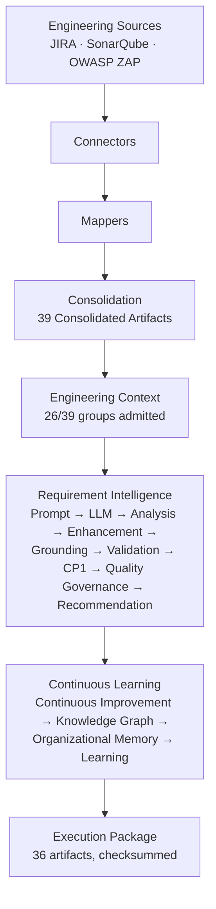
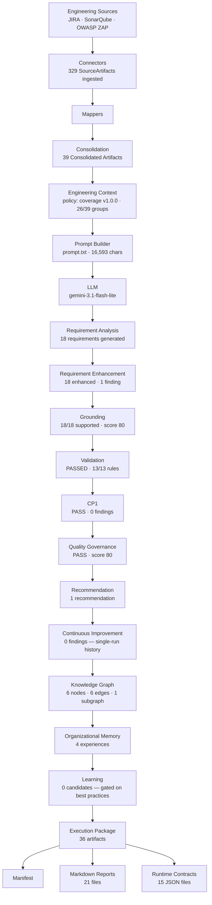
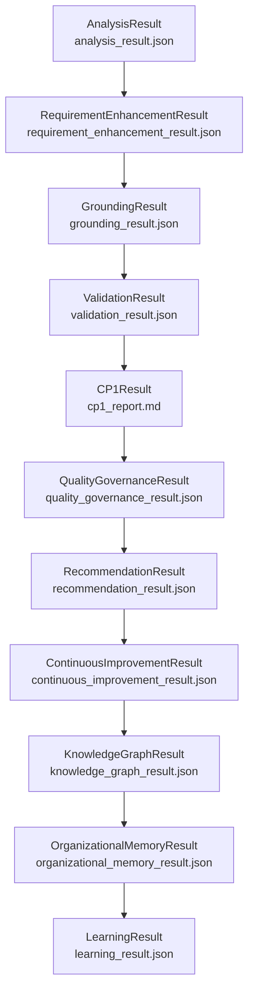
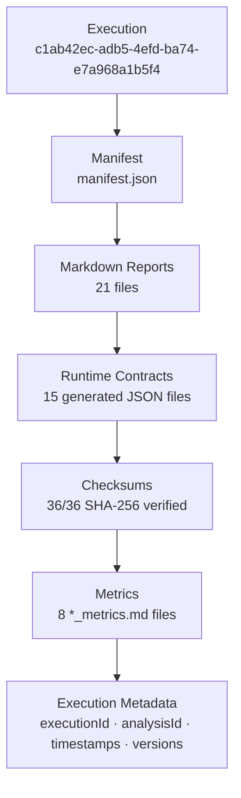

# Demo Runbook — Requirement Intelligence Platform

> Generated from a real, verified execution. Every artifact name, count, and
> verdict below was read out of the actual execution package — nothing here
> is assumed.

**Reference execution**

| Field | Value |
| --- | --- |
| Execution Package Id | `EP-20260720-070156-c1ab42ec` |
| Execution Id | `c1ab42ec-adb5-4efd-ba74-e7a968a1b5f4` |
| Analysis Id | `ede0d272-a94a-4a33-b8f7-1f2426752bac` |
| Execution Name | `demo-readiness-20260720` |
| Package Folder | `output/executions/demo-readiness-20260720/` (mirrored to `output/latest/`) |
| Execution Mode | `API` (live JIRA + SonarQube + OWASP ZAP) |
| Provider / Model | `gemini` / `gemini-3.1-flash-lite` |
| Platform Version | 1.0.0 |
| Architecture Version | 1.2.0 |
| Execution Package Version | 1.0.0 |
| Manifest Schema Version | 1.0.0 |
| Executed At | 2026-07-20T07:01:56Z → 07:02:00Z (≈3.8s wall clock) |

All file paths below are relative to `output/executions/demo-readiness-20260720/`
unless stated otherwise. A presenter can run every command in this document,
in order, without opening any other file.

---

# Platform Architecture

> Every diagram in this section is built from the actual execution order and
> artifacts of `EP-20260720-070156-c1ab42ec` — the verbose CLI trace, the
> manifest's per-subsystem `*Executed` flags, and the `generatedArtifacts`
> checksum list. No stage below was assumed; each was observed running, in
> this order, in this execution.

## Diagram 1 — Platform Overview



**Purpose** — explain the whole platform in 20 seconds, before opening a single file.

**What the audience should understand** — raw engineering signals from three independent systems become one governed, checksummed package, through exactly two reasoning phases: one that judges a single execution, and one that accumulates across many.

**Key message** — every capability produces an immutable runtime contract; nothing in this flow is ad hoc.

**Speaking time** — 20 seconds.

---

## Diagram 2 — Complete Runtime Data Flow

The primary architecture diagram. This is the literal, observed execution
order from the verbose run of `demo-readiness-20260720` — not an idealized
sequence.



**Purpose** — show how engineering data flows through the entire platform, end to end, in the exact order this execution actually ran it.

**What the audience should understand** — the pipeline is strictly linear and one-directional up through Execution Package; Manifest, Markdown Reports, and Runtime Contracts are then written together as three faces of the same package, not three more sequential stages.

**Key message** — Requirement Enhancement runs *before* Grounding, and Grounding runs *before* Validation — enrichment and evidence-judgement both happen ahead of the correctness gate, so nothing ungrounded or unenhanced ever reaches CP1 or Quality Governance.

**Speaking time** — 90 seconds (walk it stage by stage, pointing at the corresponding runbook section below).

---

## Diagram 3 — Runtime Contract Flow

Every immutable runtime model this execution actually produced, in the order
`manifestSchemaVersion`'s subsystem flags confirm they were generated.



**Purpose** — show that every capability's output is a named, typed, versioned model — not a free-form blob.

**What the audience should understand** — each result carries its own `resultVersion` and `frameworkVersion` (all `1.0.0` in this execution, `RecommendationResult` policy at `1.1.0`), and each downstream result explicitly lists which upstream result ids it consumed — visible directly in the report tables shown in Stages 6–15.

**Key message** — `CP1Result` is the one model in this chain serialized as Markdown (`cp1_report.md`) rather than JSON; every other result has both a JSON and a Markdown form. Worth knowing before someone asks "why is this one different."

**Speaking time** — 60 seconds.

---

## Diagram 4 — Execution Package Composition



**Purpose** — show how one execution becomes one auditable, self-verifying package on disk.

**What the audience should understand** — `manifest.json` is the entry point; every other file it references is checksum-verifiable against it, and nothing in the package depends on anything outside the package to be trusted.

**Key message** — this execution's package was independently re-verified after generation: 36/36 artifacts, SHA-256 and byte-count both matched, 0 mismatches, 0 missing files (see the Testing section below).

**Speaking time** — 45 seconds.

---

## Stage 0 — Repository Validation

**Purpose** — prove the repository is in a runnable, tested state before the audience sees anything.

**Command executed**
```bash
git status
python -m pytest -q
python scripts/run_requirement_analysis.py health
```

**Expected outcome** — clean git tree, all tests pass, all three sources `READY`.

**Artifacts produced** — none (validation only).

**Files to open during the demo** — none.

**Talking points**
- Working tree is clean, `main` branch, nothing uncommitted.
- 4,642 tests pass in ~8.5 seconds.
- All three source systems (JIRA, OWASP ZAP, SonarQube) reported `READY` in both `FILE` and `API` health checks.

**Suggested explanation** — "Before any demo, the platform proves it's healthy on its own terms: automated tests, then a live health probe of every configured source. Nothing downstream runs until this is green."

**Estimated speaking time** — 30s

---

## Stage 1 — Execution (Connectors → Consolidation)

**Purpose** — ingest raw engineering signals from three independent source systems and group them by shared subject.

**Command executed**
```bash
python scripts/run_requirement_analysis.py analyze --validate \
    --execution-name demo-readiness-20260720 --verbose
```

**Expected outcome** — every connector succeeds, source artifacts are grouped into consolidated artifacts.

**Artifacts produced** — `consolidated_artifact.json` (125,739 bytes)

**Files to open during the demo**
```bash
cat output/executions/demo-readiness-20260720/consolidated_artifact.json | head -40
```

**Talking points**
- **329** raw `SourceArtifacts` ingested live: JIRA issues, OWASP ZAP alerts, SonarQube findings.
- Consolidation grouped them into **39** `ConsolidatedArtifacts` — records that share one subject (a component or an endpoint).
- The primary group selected for this session: `cons-component-automation-poc-src-test-java-com-automation-pages-badexamples-badloginpage-java` (71 artifacts inside it — the largest group).

**Suggested explanation** — "Three source systems, one canonical shape. Consolidation doesn't reason about anything yet — it just answers 'which records belong together.'"

**Estimated speaking time** — 45s

---

## Stage 2 — Engineering Context

**Purpose** — choose, rank, and budget the evidence one reasoning session is allowed to see.

**Command executed** — same `analyze --validate` run (Engineering Context Orchestration is an internal pipeline stage, not a separate CLI call).

**Expected outcome** — a governed, bounded `EngineeringContext` composed under an explicit policy, with full ranking and coverage recorded.

**Artifacts produced** — `engineering_context.json` (94,731 bytes)

**Files to open during the demo**
```bash
python3 -m json.tool output/executions/demo-readiness-20260720/engineering_context.json | head -60
```

**Talking points**
- Context Id: `ctx-automation-poc-src-test-java-com-automation-pages-badexamples-badloginpage-java-7c18413cf500`
- Orchestration policy: **`coverage` v1.0.0**, strategy **`coverage_guaranteed`**
- **26 of 39** candidate groups were admitted; every excluded candidate has a recorded reason.
- Evidence composition: functional=25, security=0, quality=25 (total **50** artifacts) — evidence budget was allocated 50 and spent 50 (**truncated: true**, i.e. more evidence existed than the budget allowed).
- `coverageComplete: true` — every evidence domain the policy required was represented.

**Suggested explanation** — "This is the file that answers 'what did the model actually see, and why?' No orchestration decision is hidden — every admitted and excluded group has a reason attached."

**Estimated speaking time** — 60s

---

## Stage 3 — Prompt

**Purpose** — render the `EngineeringContext` into the exact, governed prompt sent to the model.

**Artifacts produced** — `prompt.txt` (16,653 bytes), `llm_request.json` (18,063 bytes)

**Files to open during the demo**
```bash
cat output/executions/demo-readiness-20260720/prompt.txt | head -50
```

**Talking points**
- Prompt Version: **1.0.0**, Reasoning Contract Version: **1.0.0**.
- `promptSha256` in the manifest makes this exact prompt reproducible and diffable against any other run.
- The Prompt Builder always consumes `EngineeringContext`, never a raw `ConsolidatedArtifact` — the audience already saw why that distinction matters in Stage 2.

**Suggested explanation** — "This is the literal text sent to Gemini — nothing hidden, nothing templated at call time. If the audience asks 'what did you actually ask the AI,' this is the answer."

**Estimated speaking time** — 30s

---

## Stage 4 — LLM

**Purpose** — submit the prompt to Google Gemini and capture the raw, unmodified response.

**Artifacts produced** — `raw_llm_response.json` (8,813 bytes)

**Files to open during the demo**
```bash
cat output/executions/demo-readiness-20260720/raw_llm_response.json | head -30
```

**Talking points**
- Model: **gemini-3.1-flash-lite**.
- Response: 3,556 characters, strict JSON validity: **valid**.
- Execution duration for the whole pipeline: **3,812.26 ms** — almost all of it is this one network call.

**Suggested explanation** — "One call, no retries, no hidden reformatting. `raw_llm_response.json` is exactly what the provider returned."

**Estimated speaking time** — 20s

---

## Stage 5 — Analysis

**Purpose** — carry the raw response, with full provenance, into a typed `AnalysisResult`.

**Artifacts produced** — `analysis_result.json` (11,436 bytes)

**Files to open during the demo**
```bash
python3 -m json.tool output/executions/demo-readiness-20260720/analysis_result.json | head -40
```

**Talking points**
- The model generated **9 functional**, **3 security**, and **6 quality** requirements (18 total), plus 4 risks and 5 AI-side recommendations.
- `AnalysisResult` is deliberately **un-validated** at this stage — it asserts nothing about correctness yet. That's the next four stages' job.

**Suggested explanation** — "Analysis owns exactly one thing: carrying the model's answer forward with its provenance. It doesn't judge it."

**Estimated speaking time** — 30s

---

## Stage 6 — Requirement Enhancement

**Purpose** — deterministically enrich the 18 generated requirements, detect relationships between them, and surface observations before anything downstream judges the response.

**Artifacts produced** — `requirement_enhancement_result.json` (16,257 bytes), `requirement_enhancement_report.md` (5,017 bytes), `requirement_enhancement_metrics.md` (542 bytes)

**Files to open during the demo**
```bash
cat output/executions/demo-readiness-20260720/requirement_enhancement_report.md
```

**Talking points**
- **18 requirements enhanced**, enrichment coverage **1.000** (every requirement got attributes).
- **0 relationships detected** between requirements — the enhancement engine explicitly flags this: 1 finding, `The relationship graph has 18 disconnected component(s)`.
- This finding is not a bug — it's the enhancement layer honestly reporting that this particular requirement set has no cross-references, and it flows forward (see Stage 11, Recommendation).

**Suggested explanation** — "Enhancement is a peer of Analysis, not a fixer — it enriches and observes deterministically, with no AI call of its own. When it finds something worth flagging, like an unusually flat relationship graph, that finding travels downstream instead of being silently dropped."

**Estimated speaking time** — 45s

---

## Stage 7 — Grounding

**Purpose** — judge whether each generated requirement is actually supported by the evidence the reasoner saw (Stage 2), independent of whether it merely *sounds* plausible.

**Artifacts produced** — `grounding_result.json` (652,001 bytes), `grounding_report.md` (2,184 bytes), `grounding_metrics.md` (810 bytes)

**Files to open during the demo**
```bash
cat output/executions/demo-readiness-20260720/grounding_report.md
```

**Talking points**
- **18/18 requirements grounded** — every single one classified `supported`, **0 hallucinations**.
- Overall grounding score: **80**, all at `high` confidence band, average confidence 80.00.
- Cross-source support ratio: **1.00** — every requirement traces to evidence from more than one source artifact.
- This is a deterministic, rule-based judgement — not another AI call grading the first one.

**Suggested explanation** — "This is the platform's answer to 'how do you know the AI didn't make it up?' Grounding independently checks every requirement against the evidence set from Stage 2 and would flag anything unsupported. Here, nothing was."

**Estimated speaking time** — 60s (this is a strong stage to dwell on)

---

## Stage 8 — Validation

**Purpose** — run the response through ordered rule stages (Transport → Syntax → Schema → Content → Reasoning) and produce one verdict.

**Artifacts produced** — `validation_result.json` (13,087 bytes), `validation_report.md` (1,126 bytes)

**Files to open during the demo**
```bash
cat output/executions/demo-readiness-20260720/validation_report.md
```

**Talking points**
- Overall Verdict: **PASSED**. 13 rules executed, 0 issues, 0 of any severity (info/warning/error/critical/blocking).
- Validation duration: **0.05 ms** — this is pure rule evaluation, not another model call.
- Every layer (Transport, Syntax, Schema, Content, Reasoning) reports 0 issues.

**Suggested explanation** — "Validation owns correctness, and it's fast because it's deterministic — five ordered rule layers, no LLM in the loop."

**Estimated speaking time** — 30s

---

## Stage 9 — CP1 (Engineering Readiness)

**Purpose** — the engineering-readiness gate. Opens only on a passing validation verdict.

**Artifacts produced** — `cp1_report.md` (964 bytes)

**Files to open during the demo**
```bash
cat output/executions/demo-readiness-20260720/cp1_report.md
```

**Talking points**
- Overall Verdict: **PASS**, 0 findings, criteria contract `CP1-0001`.
- CP1 only ran because Validation passed in Stage 8 — the gate is real, not decorative.

**Suggested explanation** — "CP1 answers a narrower question than Validation: not just 'is this response well-formed,' but 'is it ready for downstream engineering work.'"

**Estimated speaking time** — 20s

---

## Stage 10 — Quality Governance

**Purpose** — the terminal release authority. Judges Grounding + Validation + CP1 together into one governed release decision. Consumes all three; re-runs none of them.

**Artifacts produced** — `quality_governance_result.json` (1,546 bytes), `quality_governance_report.md` (821 bytes), `quality_governance_summary.md` (266 bytes)

**Files to open during the demo**
```bash
cat output/executions/demo-readiness-20260720/quality_governance_summary.md
```

**Talking points**
- Release Decision: **PASS** ("assessment clean"), overall quality score **80**, 0 warnings, 0 failures.
- Policy: `default-quality-policy` v1.0.0.
- The report explicitly lists its three consumed inputs — `grounding`, `validation`, `cp1` — each with its own result id, proving governance didn't re-derive anything.

**Suggested explanation** — "This is the single terminal verdict for the whole run — the one line an approver actually needs. Everything above it (Grounding, Validation, CP1) feeds in; nothing feeds back."

**Estimated speaking time** — 45s

---

## Stage 11 — Recommendation

**Purpose** — turn upstream findings (from Enhancement, Grounding, Validation, CP1, Quality Governance) into actionable, prioritized recommendations.

**Artifacts produced** — `recommendation_result.json` (2,447 bytes), `recommendation_report.md` (1,305 bytes), `recommendation_metrics.md` (433 bytes)

**Files to open during the demo**
```bash
cat output/executions/demo-readiness-20260720/recommendation_report.md
```

**Talking points**
- **1 recommendation** generated: `Clarify the disconnected requirement set` — medium priority, confidence 0.75.
- Traces directly back to the Enhancement finding from Stage 6 (`ef-ro-5ce6c13a30a9`) — a clean, auditable line from finding to recommendation.
- The report table shows every consumed input (enhancement, grounding, validation, cp1, quality_governance) with its exact result id and version.

**Suggested explanation** — "This is where a real finding becomes a real action item — and you can trace it back to exactly which upstream stage raised it."

**Estimated speaking time** — 30s

---

## Stage 12 — Continuous Improvement

**Purpose** — detect trends and improvement opportunities across execution history.

**Artifacts produced** — `continuous_improvement_result.json` (1,020 bytes), `continuous_improvement_report.md` (1,110 bytes), `continuous_improvement_metrics.md` (463 bytes)

**Files to open during the demo**
```bash
cat output/executions/demo-readiness-20260720/continuous_improvement_report.md
```

**Talking points**
- **0 findings, 0 trends, 0 opportunities** for this run.
- This is expected, not broken: the historical dataset for this run is `single-execution:c1ab42ec…` — exactly **1** execution. Trend detection needs more than one data point by design.
- **Demo tip:** if you have time, run `analyze --validate` a second and third time and re-open this report — trend detection activates once history accumulates.

**Suggested explanation** — "Continuous Improvement doesn't fabricate a trend from one run — it correctly reports that it has nothing to say yet. That restraint is itself the feature."

**Estimated speaking time** — 30s

---

## Stage 13 — Knowledge Graph

**Purpose** — project this execution's requirements, recommendations, and findings into a governed, typed graph.

**Artifacts produced** — `knowledge_graph_result.json` (5,884 bytes), `knowledge_graph_report.md` (3,445 bytes), `knowledge_graph_metrics.md` (656 bytes)

**Files to open during the demo**
```bash
cat output/executions/demo-readiness-20260720/knowledge_graph_report.md
```

**Talking points**
- **6 nodes** (execution, requirement, recommendation, finding, capability, dataset), **6 edges**, **1 fully-connected subgraph**.
- 0 dangling references — the report's own structural-consistency observation confirms every edge resolved.
- 6 distinct governed edge types: `belongs_to`, `derived_from`, `generated_by`, `implements`, `related_to`, `traceable_to` — each with an explicit rationale in the report, not just a label.

**Suggested explanation** — "Every node and edge here is derived deterministically from this run's own results — nothing is invented, and every edge states *why* it exists."

**Estimated speaking time** — 45s

---

## Stage 14 — Organizational Memory

**Purpose** — capture this execution's Knowledge Graph and Continuous Improvement outputs as durable organizational experience.

**Artifacts produced** — `organizational_memory_result.json` (2,663 bytes), `organizational_memory_report.md` (1,872 bytes), `organizational_memory_metrics.md` (382 bytes)

**Files to open during the demo**
```bash
cat output/executions/demo-readiness-20260720/organizational_memory_report.md
```

**Talking points**
- **4 experiences** captured, each sourced from a specific Knowledge Graph observation, each at `low` confidence and lifecycle state `active` / "newly captured".
- **0 lessons, 0 best practices, 0 promotions** — by design: lessons are promoted from *repeated* experience, and this is experience #1.
- The consumed-inputs table shows exactly which Continuous Improvement and Knowledge Graph result ids fed this stage.

**Suggested explanation** — "This is where a single run starts turning into institutional memory. Nothing is promoted to a 'lesson' on the strength of one execution — that threshold is deliberate."

**Estimated speaking time** — 30s

---

## Stage 15 — Learning

**Purpose** — the deterministic learning engine: propose, validate, and mature learning candidates sourced from Organizational Memory's best practices.

**Artifacts produced** — `learning_result.json` (892 bytes), `learning_report.md` (1,033 bytes), `learning_metrics.md` (303 bytes)

**Files to open during the demo**
```bash
cat output/executions/demo-readiness-20260720/learning_report.md
```

**Talking points**
- **0 candidates, 0 learnings, 0 validations** — because Learning consumes Organizational Memory's best practices (Stage 14), and Stage 14 produced 0 best practices on this single run.
- This is the top of a four-stage evidence chain: Knowledge Graph → Continuous Improvement → Organizational Memory → Learning. Nothing at the top is asserted unless every link below it earned it.
- **Demo tip:** this is the strongest "nothing is faked here" moment in the whole demo — point out that an AI platform claiming to "learn" after one execution would be the red flag, not the green one.

**Suggested explanation** — "Learning is deterministic and gated — it will not manufacture a learning from a single run just to look active. That's a governance decision, not a missing feature."

**Estimated speaking time** — 45s

---

## Stage 16 — Execution Package

**Purpose** — serialize every runtime model produced above, plus a checksummed manifest, to disk.

**Artifacts produced** — all 36 files listed in Stage "Manifest" below, written to `output/executions/demo-readiness-20260720/` and mirrored to `output/latest/`.

**Files to open during the demo**
```bash
ls output/executions/demo-readiness-20260720/ | sort
```

**Talking points**
- 36 generated artifacts + `manifest.json` = 37 files total.
- 21 Markdown reports, 15 generated JSON files (16 including the manifest itself).
- Package size: **~1.1 MB**.
- Every artifact's SHA-256 and byte count are independently verifiable against the manifest (see Testing section below).

**Suggested explanation** — "This directory is the complete, self-describing record of the run. Nothing about this execution lives only in memory or only in a log line."

**Estimated speaking time** — 30s

---

## Stage 17 — Feature Engineering (Layer 2, stage 14)

**Purpose** — show the Layer 1 → Layer 2 handoff running live: one `TestableRequirement` in, one lint-clean, tagged, multi-scenario `.feature` file out, gated by a deterministic CP2 check with a bounded self-healing backstop behind it.

**Second reference execution — this stage only.** `demo-readiness-20260720` (the execution behind every stage above) predates Layer 2 entirely: stage 14 was wired into `analyze` in a later task, so that execution never touched it. This stage instead cites a separate, real live execution where Layer 2 did run, end to end, against the same saucedemo.com corpus:

| Field | Value |
| --- | --- |
| Run Id | `run-20260728T172651881816Z-c6695f94` |
| Execution Name | `saucedemo-30req-measurement-clean` |
| Folder | `output/executions/run-20260728T172651881816Z-c6695f94/` |
| Requirements processed | 30 |
| CP2 verdict | 30/30 `pass`, 0 remediated, 0 escalated |

All paths below are relative to that folder, not `output/executions/demo-readiness-20260720/`.

**Command executed** — the same `analyze` command already shown in Stage 1; **no new flag exists or is needed**. Stage 14 fires automatically whenever Layer 1 clears Quality Governance and emits a `TestableRequirementSet` (skipped only for `--dry-run`, where no `TestableRequirementSet` is ever emitted):
```bash
python scripts/run_requirement_analysis.py analyze --validate \
    --execution-name <your-run-name> --verbose
```

**Expected outcome** — after the existing Stage 1–16 output, the console prints a new block:
```
Generating Features (Layer 2)
  30 feature(s) generated
```
(a `⚠ N feature(s) escalated for human review` line appears only if CP2 still fails after D5's two remediation attempts — did not happen in this run.)

**HONEST TIMING — read this before presenting live.** Layer 1 (Stages 1–16) finishes in ~5 seconds — one Gemini call. Layer 2 then makes up to `1 + N + 2N` additional Gemini calls for `N` requirements: one generation call per requirement, plus up to two bounded D5 remediation calls each, only if CP2 fails (ADR-0040 Decision 1 / ADR-0043 D5's fixed 2-attempt cap). For this 30-requirement corpus that ceiling is 91 calls; the actual count on a clean run is 30 (D5 never engaged — see below). On the Gemini free tier, `gemini-3.1-flash-lite` is quota-limited to **15 requests/minute** — this exact limit is what the API itself reported during this measurement (`generativelanguage.googleapis.com/generate_content_free_tier_requests`, `GenerateRequestsPerMinutePerProjectPerModel-FreeTier`). One of the two live runs behind this doc hit it: generation failed outright at requirement #17 with a `429 RESOURCE_EXHAUSTED` error — the platform performs **no retries of its own** anywhere in this call path (`GeminiProvider`/`LiveFeatureContentGenerator` both make exactly one call and surface whatever comes back), so this is a real, visible failure, not silent backoff. **Do not promise a fixed duration.** Depending on free-tier quota state at demo time, expect anywhere from ~3 minutes (no quota hit, ~5–6s/requirement once under way) to 10+ minutes (one or more real 429s requiring a resume, below). If it happens on stage, that's expected, not a broken demo.

**Recovery — if a 429 happens live:** the run is safely resumable, with no repeated LLM calls for work already done. Stage 14 skips any requirement whose `content_hash` is unchanged and whose feature file already exists on disk (ADR-0036/ADR-0043 D8) — a resume regenerates only what's left:
```bash
python scripts/run_requirement_analysis.py analyze --resume run-20260728T172651881816Z-c6695f94 --verbose
```
This is exactly what happened behind this reference execution: the first invocation failed at requirement #17; a `--resume` of the same run id, run a few minutes later, picked up at #17 and finished all 30 without touching the first 16 again. The overall `analyze` command still exits `0` on a stage 14 failure — only `execution_package_write` failing is treated as fatal — so a presenter sees a clean `Feature Engineering failed: ...` line, not a crash.

**Artifacts produced**
- `feature_engineering_package.json` — one structured `FeatureRecord` per requirement (CP2 verdict, remediation/escalation flags, `SCN-*`/`AC-*` coverage, feature path).
- `feature_engineering_report.md` — the human-readable table version of the same.
- `traceability.json` — derived index of every `REQ-*`/`AC-*`/`SCN-*` triple and its feature path (the source of truth is the Gherkin tags themselves, per ADR-0043 D2; this file is a read-back, not the source).
- One `.feature` file per requirement, written to the **per-run, gitignored workspace** — see below.

**Files to open during the demo**
```bash
cat "output/executions/run-20260728T172651881816Z-c6695f94/feature_engineering_report.md"

cat "output/executions/run-20260728T172651881816Z-c6695f94/workspace/src/test/resources/features/Automation-POC:src/test/java/com/automation/pages/badexamples/BadCartPage.java/the-system-shall-redirect-authenticated-standard-user-to-the-inventory-page-upon-successful-login-req-8604e1d3.feature"
```

**Where generated output actually lives — and where it does NOT.** Generated `.feature` files land in `output/executions/<run_id>/workspace/src/test/resources/features/...` — an isolated, per-run copy of the tracked test-suite baseline, materialized fresh for this run alone (`feature_engineering/stage/workspace.py`, ADR-0037 Path A). **`test-suite-baseline/` at the repo root is deliberately never written to by this stage** — it is the source `materialize_workspace` copies *from*, read-only, so two runs (or a run and the tracked source) never share one directory. Confirmed clean: `git status --porcelain test-suite-baseline/` reports nothing. If someone asks "where's the generated code," the answer is the run's own `workspace/`, never `test-suite-baseline/`. The whole `output/` tree is gitignored (`.gitignore:39`), so none of this — including a presenter's own live-run output — is ever at risk of being committed.

**Talking points**
- **30/30 requirements passed CP2 on their first generation attempt** — lint-clean, correctly tagged (`@REQ-*` feature-level, `@AC-*`/`@SCN-*` scenario-level), full acceptance-criteria coverage. 0 remediated, 0 escalated (`feature_engineering_report.md`'s own `Remediated`/`Escalated` columns, all `False`).
- **D5 (bounded, 2-attempt LLM remediation) is a proven backstop, not something this demo routinely exercises.** It is real, wired, and tested — but it has never fired on a live run: two live runs, 60 total generations, zero engagements. Do not claim "watch it self-heal" as expected behavior. If someone specifically wants to see D5 fire, the honest answer is to point at its test coverage (`tests/unit/test_feature_engineering_remediation.py`, `test_feature_engineering_live_remediator.py`) — construct-tested against deterministic stubs/fakes, never a live model — not to attempt forcing a live CP2 failure on stage, which is neither scripted nor guaranteed to reproduce.
- **The functional requirements are real; the security/quality findings are representative fixtures, not real scans.** The JIRA issues behind this corpus (`requirement_intelligence/input/jira/jira-issues.json`) are real, hand-authored functional requirements describing saucedemo.com's actual behavior (login, inventory, cart, checkout) — its own `_fixtureNotice` says so plainly. The SonarQube and OWASP ZAP inputs are **REPRESENTATIVE FIXTURES**: every record is unmistakably marked (`ZAP-FIXTURE-*` plugin ids, `sonar-fixture:*` issue keys, an explicit `_fixtureNote`/`_fixtureNotice` on each file) — no ZAP or SonarQube scan has ever actually been run against saucedemo.com. This demo proves the **functional generation path end-to-end on real content**, and proves the **SAST/DAST-shaped generation path structurally** (a security/quality finding correctly becomes a tagged scenario) — it does not demonstrate real scanner integration. Say this plainly if asked.
- Escalation is a real, wired outcome (a CLI `⚠` warning line, plus an `escalated: true` record with a reason) — it simply didn't occur in either live run behind this doc.

**Suggested explanation** — "Layer 1 hands off a governed `TestableRequirementSet`; Layer 2 turns each requirement into a lint-clean, traceable `.feature` file behind a deterministic gate, with a bounded, 2-attempt self-healing loop behind that gate as a backstop, not a crutch. Every one of these 30 requirements passed clean on the first try — including the ones sourced from representative security/quality fixtures, not real scans, which I want to be upfront about."

**Estimated speaking time** — 90 seconds (120 if walking through the 429/resume story).

---

## Manifest

**Purpose** — the canonical entry point to the whole execution: versions, hashes, timings, verdicts, and every subsystem's executed/report/metrics fields.

**Command executed**
```bash
python3 -m json.tool output/executions/demo-readiness-20260720/manifest.json | head -40
```

**Talking points**
- Identity: `executionId`, `analysisId`, `executionPackageId` (from `execution_summary.md`: `EP-20260720-070156-c1ab42ec`).
- Provenance: `promptSha256`, `responseSha256`, `promptCharacterCount`, `responseCharacterCount`.
- Orchestration: `orchestrationPolicyId: coverage`, `contributingGroupCount: 26`, `candidateGroupCount: 39`, `coverageComplete: true`.
- Per-subsystem boolean flags, all **true** for this run: `cp1Executed`, `qualityGovernanceExecuted`, `requirementEnhancementExecuted`, `recommendationExecuted`, `continuousImprovementExecuted`, `knowledgeGraphExecuted`, `organizationalMemoryExecuted`, `learningExecuted` — each paired with its report/metrics filename.
- `generatedArtifacts`: an array of 36 `{name, bytes, sha256}` entries — the audit trail for every file in the package.

**Suggested explanation** — "If someone asks 'how do I know this is the file that was actually produced by this run,' the answer is always: check its SHA-256 against this one file."

**Estimated speaking time** — 45s

---

## Testing

**Purpose** — demonstrate that the package is independently verifiable, not just self-reported.

**Command executed**
```bash
python -m pytest -q
python3 - <<'PY'
import json, hashlib, os
d = "output/executions/demo-readiness-20260720"
m = json.load(open(f"{d}/manifest.json"))
ok = 0
for a in m["generatedArtifacts"]:
    data = open(f"{d}/{a['name']}", "rb").read()
    assert hashlib.sha256(data).hexdigest() == a["sha256"]
    assert len(data) == a["bytes"]
    ok += 1
print(f"{ok}/{len(m['generatedArtifacts'])} artifacts checksum-verified")
PY
```

**Expected outcome** — `4642 passed`; `36/36 artifacts checksum-verified`.

**Talking points**
- The unit/integration suite (4,642 tests) covers every subsystem shown in this demo, independent of any specific execution.
- The checksum script above was actually run against this exact package during readiness validation — 36/36 verified, 0 mismatches, 0 missing files.

**Estimated speaking time** — 30s

---

## Architecture

**Purpose** — orient the audience on how the stages above map to the codebase, in case of follow-up questions.

**Talking points**
- Style: modular monolith, one deployable FastAPI unit.
- Layer 1 (Requirement Intelligence): `requirement_intelligence/{connectors,mappers,consolidation,context_orchestration,prompts,llm,analysis,validation,cp1,execution}`.
- "Layer 2" (added post-CAP-077): `requirement_intelligence/{enhancement,grounding,quality_governance,recommendation,continuous_improvement,knowledge_graph,organizational_memory,learning}` — internal, CAP-077-era naming that predates the platform's own 7-layer model (ADR-0031) and describes Requirement Enhancement through Learning, all still inside Layer 1's own package.
- **Naming collision, worth knowing before someone asks:** the platform's *architecturally-defined* Layer 2 is Feature Engineering (ADR-0031, ADR-0043) — a physically separate top-level package, `feature_engineering/{generation,cp2,remediation,gherkin_lint,prompts,stage}` — demonstrated live in Stage 17 above. The two "Layer 2" labels name genuinely different things; if asked, say so plainly rather than picking one silently.
- Runtime data flow is strictly linear and one-directional — see `README.md` § Runtime Architecture for the full diagram; every arrow in that diagram was exercised in this execution.
- Full stage-by-stage architecture doc: `docs/architecture/overview.md`; execution package field reference: `docs/architecture/execution-package.md`; Layer 2's own architecture freeze: `docs/adr/0043-layer-2-feature-engineering-architecture-freeze.md`.

**Estimated speaking time** — 60s (only if asked)

---

## Roadmap

**Purpose** — set expectations for what's next, honestly.

**Talking points**
- Phase 1 (Requirement Intelligence) is complete end to end, as this execution demonstrates.
- **Phase 2 (Feature Engineering) is live, not a placeholder** — see Stage 17. Requirement → lint-clean, tagged, multi-scenario `.feature` file → deterministic CP2 gate → bounded D5 self-healing backstop → isolated per-run workspace, proven against 30/30 real saucedemo.com requirements across two live runs.
- Phases 3–7 (Automation Engineering, further Quality Governance, Execution, Failure Intelligence/Self-Healing, Governance Dashboard) remain placeholders in the repo layout — directories exist, implementation does not.
- Continuous Improvement, Organizational Memory, and Learning are architecturally live but data-starved on a single execution — running the demo pipeline repeatedly (see Stage 12 tip) is the fastest way to show them activate.

**Estimated speaking time** — 30s

---

## Total estimated demo time

~10–12 minutes for the full walkthrough (Stages 0–16 + Manifest + Testing), or ~6 minutes if Architecture and Roadmap are skipped unless asked. Add ~3–4 minutes if walking through all four Platform Architecture diagrams. Add ~90 seconds to *narrate* Stage 17 from the already-archived reference execution's artifacts (no live wait). If Stage 17 is run **live**, budget separately and generously — anywhere from ~3 to 10+ minutes depending on free-tier quota state at the time (see Stage 17's own HONEST TIMING note) — and treat it as a distinct live segment, not part of the ~10–12 minute walkthrough estimate above.

---

## Architecture Summary

### Layer 1 — Requirement Intelligence

Per-execution ingestion, reasoning, and governance. Every capability below reported `executed: true` (or an equivalent PASS/complete verdict) in this execution's manifest.

| Capability | Completed | Evidence |
| --- | --- | --- |
| Connectors (JIRA, SonarQube, OWASP ZAP) | ✓ | 329 source artifacts ingested live |
| Mappers | ✓ | canonical `SourceArtifact` shape confirmed in `consolidated_artifact.json` |
| Consolidation | ✓ | 39 Consolidated Artifacts (`consolidationEngineVersion` 1.0.0) |
| Engineering Context Orchestration | ✓ | `contextOrchestrationVersion` 2.0.0 · policy `coverage` v1.0.0 · 26/39 groups admitted |
| Prompt Builder | ✓ | `promptFrameworkVersion` 1.0.0 · `prompt.txt` reproducible via `promptSha256` |
| LLM Integration | ✓ | `llmFrameworkVersion` 1.0.0 · gemini-3.1-flash-lite |
| Requirement Analysis | ✓ | `analysisServiceVersion` 1.0.0 · 18 requirements generated |
| Requirement Enhancement | ✓ | `requirementEnhancementExecuted: true` |
| Grounding | ✓ | 18/18 supported, 0 hallucinations, score 80 |
| Validation | ✓ | PASSED, 13/13 rules, 0 issues |
| CP1 | ✓ | `cp1Executed: true`, verdict `pass` |
| Quality Governance | ✓ | `qualityGovernanceExecuted: true`, decision `pass`, score 80 |
| Recommendation | ✓ | `recommendationExecuted: true`, 1 recommendation generated |

### "Layer 2" — Continuous Learning

Cross-execution history accumulation, living inside Layer 1's own package (`requirement_intelligence/{continuous_improvement,knowledge_graph,organizational_memory,learning}`) — CAP-077-era internal naming, not the platform's architecturally-defined Layer 2 (see the table below). All four capabilities executed successfully; three of the four correctly produced zero output because this was the platform's first execution in its history dataset (`single-execution:c1ab42ec…`), not because anything failed.

| Capability | Completed | Evidence |
| --- | --- | --- |
| Continuous Improvement | ✓ | `continuousImprovementExecuted: true` — 0 findings/trends (expected on 1 execution) |
| Knowledge Graph | ✓ | `knowledgeGraphExecuted: true` — 6 nodes, 6 edges, 1 fully-connected subgraph, 0 dangling refs |
| Organizational Memory | ✓ | `organizationalMemoryExecuted: true` — 4 experiences captured, 0 lessons (expected on 1 execution) |
| Learning | ✓ | `learningExecuted: true` — 0 candidates (gated on Organizational Memory best practices, none yet) |

### Layer 2 — Feature Engineering (architecturally-defined, ADR-0031/ADR-0043)

A physically separate package (`feature_engineering/`), not the "Layer 2" table above. **Evidence is from a separate reference execution** (`run-20260728T172651881816Z-c6695f94` — see Stage 17), since `demo-readiness-20260720` predates this stage's CLI wiring.

| Capability | Completed | Evidence |
| --- | --- | --- |
| Feature generation (1 requirement → 1 `.feature`) | ✓ | 30/30 requirements produced a lint-clean, tagged feature |
| CP2 (deterministic gate: lint + AC coverage + tag presence + duplicates) | ✓ | 30/30 `pass` on first attempt |
| D5 (bounded, 2-attempt LLM remediation) | Wired, not engaged | 0/30 remediated — proven backstop, not exercised on this corpus |
| Escalation (human-in-the-loop on D5 exhaustion) | Wired, not engaged | 0/30 escalated |
| Isolated per-run workspace (ADR-0037 Path A) | ✓ | `test-suite-baseline/` untouched; output under `output/executions/<run_id>/workspace/` |

### Execution Package — Governed Outputs

| Output | Count / Detail |
| --- | --- |
| Total files | 37 (36 generated + `manifest.json`) |
| Markdown reports | 21 |
| Generated JSON files | 15 (16 including the manifest) |
| Package size | ~1.1 MB |
| Checksum integrity | 36/36 artifacts SHA-256 + byte-count verified against `manifest.json`, 0 mismatches |

### Current Versions (from this execution's manifest)

| Field | Value |
| --- | --- |
| Architecture Version | 1.2.0 |
| Platform Version | 1.0.0 |
| Execution Package Version | 1.0.0 |
| Manifest Schema Version | 1.0.0 |
| Context Orchestration Version | 2.0.0 |
| Prompt / Reasoning Contract Version | 1.0.0 / 1.0.0 |

---

## Presenter Tips

**Show first**
- **Diagram 1 (Platform Overview)** — open the demo with this. It answers "what does this platform do" in 20 seconds before any artifact is opened.
- **Diagram 2 (Complete Runtime Data Flow)** — bring this up immediately after Diagram 1 as the map you'll be walking through for the rest of the demo.

**Keep visible while demonstrating artifacts**
- **Diagram 2** — keep it up (or reopen it) at the start of each numbered Stage section (0–16) so the audience always knows where the file they're looking at sits in the pipeline. Note: Diagram 2 is built from `demo-readiness-20260720`, which predates Layer 2 — it does not show stage 14. Stage 17 cites its own, separate reference execution instead of extending this diagram to a run it wasn't built from.
- **Diagram 3 (Runtime Contract Flow)** — reopen this specifically during Stages 6–15 (Enhancement through Learning), since each of those stages' report tables explicitly names the upstream result id it consumed — the diagram makes that chain visible at a glance.
- **Stage 17 (Feature Engineering)** — if presenting live rather than narrating from the archived artifacts, read its HONEST TIMING note first and be ready for a real free-tier 429 mid-run; the recovery is one `--resume` command, already given, not a failure to explain away.

**Only show if architecture questions are asked**
- **Diagram 4 (Execution Package Composition)** — this is a "how do you know it's trustworthy" diagram, not a narrative one. Hold it back unless someone asks how the manifest/checksums/reports relate, then pair it with the Testing section's live checksum re-verification.
- The **Architecture** and **Roadmap** sections further down this document — both are explicitly marked "only if asked" and are for depth, not the main narrative.
- The **Architecture Summary** table above — useful as a leave-behind reference after the demo, not something to read aloud during it.
