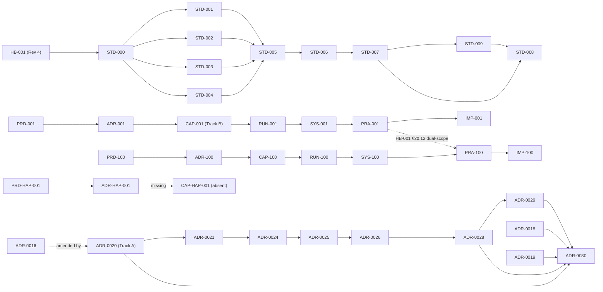

# EIOS Repository Audit — Implementation Baseline

**Principal Enterprise Architect / Chief Methodologist / Repository Auditor Report · Draft · 2026-07-22**

**Method note.** This report reconstructs the repository exactly as it exists, based on direct file inspection (`find`, `grep`, and full/partial reads across `docs/`, `requirement_intelligence/`, `app/`, `infrastructure/`, `shared/`, `scripts/`, `tests/`, root configuration files, and `output/`). Every significant conclusion below cites the file(s) it is derived from. Where evidence is absent, this report states **"Not found in repository"** rather than assuming completion or inferring intent. Where a judgment requires interpretation beyond a direct fact, it is labeled **Inference**; everything else is **Repository Evidence**.

**The single most important structural fact this audit establishes, stated once here and referenced throughout:** this repository contains **two parallel, non-integrated documentation initiatives**, both real, both extensive, that use overlapping identifiers for different things.

- **Track A — the operational system.** `docs/adr/0001–0030` (four-digit ADRs), `docs/architecture/*.md`, `docs/governance/*.md` (Freeze Index, Capability Matrix), `docs/proposals/*framework*.md`, `docs/reviews/cap-*.md`, `docs/releases/*.md`, and the real Python implementation under `requirement_intelligence/`. This track governs a real, numbered capability set **`CAP-001` through `CAP-087`** (per `docs/governance/platform-capability-matrix.md`).
- **Track B — the EIOS methodology framework.** `docs/handbook/HB-001-platform-engineering-handbook.md`, `docs/standards/STD-000` through `STD-009`, `docs/product/{PRD,ADR,CAP,RUN,SYS,PRA,IMP}-{001,100,HAP-001}*.md`, `docs/proposals/{capability-contract-standard*,governance-review-lifecycle*}.md`, and `docs/reviews/{SRR,DRC,APR,ARR,CCR,BLR}-STD-002*.md`. This track defines its own, separate `CAP-001` (`docs/product/CAP-001-requirements-intelligence.md`, titled "Requirements Intelligence" — Capture/Enrichment/Evidence Grounding).

**`CAP-001` therefore identifies two different things in this repository** — Track A's own `CAP-001` is "Connector Framework & Registry" (`docs/governance/platform-capability-matrix.md` §5.1); Track B's own `CAP-001` is "Requirements Intelligence" (`docs/product/CAP-001-requirements-intelligence.md`). No cross-reference between the two tracks resolves this. This is Repository Evidence, not Inference, and it recurs throughout this report.

---

# DELIVERABLE 1 — REPOSITORY AUDIT

## 1. Repository Inventory

Grouped by the requested categories. Fields not present in a given file are marked "Not stated." Track A's real documents largely predate HB-001's Document Metadata Standard (HB-001 §16 itself: *"This is a standard, not a migration... no existing document in this repository is required to add these fields retroactively"*) — their absence of `Owner`/`Version` fields is therefore expected, not a defect this audit newly discovers.

### Vision
| Identifier | Title | Version | Status | Owner | File Path |
| --- | --- | --- | --- | --- | --- |
| (none) | README status board — Architecture Version 1.2.0, Phase 1 Complete | 1.2.0 (Architecture Version) | Phase 1 Complete; Phases 2–7 Planned | Not stated | `README.md` |
| PRD-001 | Engineering Intelligence Platform (§3 Vision) | 1.0 | Draft | Not stated | `docs/product/PRD-001-engineering-intelligence-platform.md` |
| PRD-100 | Engineering Intelligence Operating System (§3 Vision) | 1.0 (Draft) | Draft | Chief Product Officer | `docs/product/PRD-100-engineering-intelligence-operating-system.md` |
| PRD-HAP-001 | Requirements Intelligence (§3 Vision) | 1.0 (Draft) | Draft | Engineering Product Council | `docs/product/PRD-HAP-001-requirements-intelligence.md` |

### Constitution
| Identifier | Title | Version | Status | Owner | File Path |
| --- | --- | --- | --- | --- | --- |
| HB-001 | Platform Engineering Handbook | Revision 4, Version 4.0 (Draft) | Draft — pending architecture review | Platform Architecture | `docs/handbook/HB-001-platform-engineering-handbook.md` |

### Standards
| Identifier | Title | Version | Status | Owner | File Path |
| --- | --- | --- | --- | --- | --- |
| STD-000 | Platform Constitution | 1.0 (Draft) | Draft | Not stated | `docs/standards/STD-000-platform-constitution.md` |
| STD-001 | Platform Implementation Standard | 1.0 (Draft) | Draft — pending architecture review | Platform Architecture | `docs/standards/STD-001-platform-implementation-standard.md` |
| STD-002 | Platform Capability Standard | **1.0 (Draft) on disk** — see §6 for the Baseline discrepancy | Draft | Not stated | `docs/standards/STD-002-platform-capability-standard.md` |
| STD-003 | Platform Runtime Standard | 1.0 (Draft) | Draft | Not stated | `docs/standards/STD-003-platform-runtime-standard.md` |
| STD-004 | Platform Traceability Standard | 1.0 (Draft) | Draft | Not stated | `docs/standards/STD-004-platform-traceability-standard.md` |
| STD-005 | Engineering Transformation Standard | 1.0 (Draft) | Draft | Chief Systems Architect | `docs/standards/STD-005-engineering-transformation-standard.md` |
| STD-006 | Engineering Governance Standard | 1.0 (Draft) | Draft | Platform Architecture | `docs/standards/STD-006-engineering-governance-standard.md` |
| STD-007 | Engineering Artifact Lifecycle Standard | 1.0 (Draft) | Draft | Platform Architecture | `docs/standards/STD-007-engineering-artifact-lifecycle-standard.md` |
| STD-008 | Engineering Conformance Standard | 1.0 (Draft) | Draft | Platform Architecture | `docs/standards/STD-008-engineering-conformance-standard.md` |
| STD-009 | Engineering Adoption Standard | 1.0 (Draft) | Draft | Platform Architecture | `docs/standards/STD-009-engineering-adoption-standard.md` |

Note: `STD-008` was authored after `STD-009` despite its lower number — this is documented, not an audit discovery (`STD-008` §1.1).

### Governance
| Identifier | Title | Track | File Path |
| --- | --- | --- | --- |
| (unnumbered, living) | Architecture Coverage Dashboard | A (real) | `docs/governance/architecture-coverage-dashboard.md` |
| (unnumbered, living) | Architecture Freeze Index — 16 artifacts, every Freeze Date "Not Recorded" | A (real) | `docs/governance/architecture-freeze-index.md` |
| (unnumbered, living) | Platform Capability Matrix — `CAP-001`–`CAP-087` roster | A (real) | `docs/governance/platform-capability-matrix.md` |
| (unnumbered) | Executable Specification Engineering Governance (CAP-087 only) | A (real) | `docs/governance/executable-specification-engineering-governance.md` |
| STD-006 | Engineering Governance Standard (the *rules* by which governance runs, not a governance record itself) | B (methodology) | `docs/standards/STD-006-engineering-governance-standard.md` |

### Reviews
| File | Track | Subject |
| --- | --- | --- |
| `docs/reviews/cap-074b-requirement-evidence-investigation.md` | A | CAP-074B root-cause investigation |
| `docs/reviews/cap-076-engineering-context-orchestration.md` | A | CAP-076 architecture review |
| `docs/reviews/cap-076d-release-candidate-validation.md` | A | CAP-076D RC-1 runtime validation |
| `docs/reviews/cap-077-release-validation.md` | A | CAP-077F.2 release validation |
| `docs/reviews/syntax-layer-design-review.md` | A | Pre-CAP-numbering design review |
| `docs/reviews/SRR-STD-002-R2-standards-review-record.md` | B | First review of `STD-002-R2-PROPOSAL` — Revision Required |
| `docs/reviews/SRR-STD-002-R3-standards-review-record.md` | B | Second review (implementation verification) — Approved with Conditions |
| `docs/reviews/DRC-STD-002-R2-disposition-of-review-comments.md` | B | Disposition of `SRR-STD-002-R2`'s five Findings |

### Approvals
| File | Track | Outcome |
| --- | --- | --- |
| `docs/reviews/APR-STD-002-V2.0-approval-record.md` | B | Approved with Conditions, issued by the Engineering Methodology Council, self-disclosed as a Separation-of-Authority concern |

Track A: **Not found in repository** — no artifact class named "Approval Record" exists for any `CAP-NNN`; `docs/governance/architecture-freeze-index.md` records freeze status, not a discrete approval-record artifact type.

### Ratifications
| File | Track | Outcome |
| --- | --- | --- |
| `docs/reviews/ARR-STD-002-V2.0-approval-ratification-record.md` | B | Ratified with Reservations, by the Architecture Review Board |

Track A: **Not found in repository.**

### Baselines
| File | Track | Subject |
| --- | --- | --- |
| `docs/reviews/BLR-STD-002-V2.0-baseline-record.md` | B | Declares `STD-002` v2.0 authoritative at content level; explicitly records that the physical file was **not** updated (§6, this report) |
| `docs/reviews/CCR-STD-002-V2.0-condition-closure-record.md` | B | Closes `APR-STD-002-V2.0`'s one condition |
| `docs/productization/golden-baseline.md` | A | A **different kind of baseline** — CAP-070's regression-test golden dataset, not a document-governance baseline |

### Product Requirements (PRD)
| Identifier | Title | File Path |
| --- | --- | --- |
| PRD-001 | Engineering Intelligence Platform | `docs/product/PRD-001-engineering-intelligence-platform.md` |
| PRD-100 | Engineering Intelligence Operating System | `docs/product/PRD-100-engineering-intelligence-operating-system.md` |
| PRD-HAP-001 | Requirements Intelligence | `docs/product/PRD-HAP-001-requirements-intelligence.md` |

Track A: **Not found in repository** — Track A has no `PRD`-family documents; its own chain begins at ADR.

### Architecture
| Category | Count | File Path(s) |
| --- | --- | --- |
| Track A numbered ADRs | 30 | `docs/adr/0001-*.md` – `0030-*.md` |
| Track A component architecture contracts | 16 | `docs/architecture/*.md` |
| Track B ADR-family documents | 3 | `ADR-001`, `ADR-100`, `ADR-HAP-001` in `docs/product/` |

### Capability Specifications
| Category | Count | Evidence |
| --- | --- | --- |
| Track A capabilities | 87 numbered (`CAP-001`–`CAP-087`), organized in 10 domain groups | `docs/governance/platform-capability-matrix.md` §5.1–5.10 |
| Track B capability documents | 2 (`CAP-001`, `CAP-100`) | `docs/product/CAP-001-requirements-intelligence.md`, `docs/product/CAP-100-*.md` |
| Track B capability-family methodology proposal | 2 revisions (`STD-002-R2-PROPOSAL`, `STD-002-R3-PROPOSAL`) | `docs/proposals/capability-contract-standard-*.md` |

### Runtime Models
| Identifier | File Path |
| --- | --- |
| RUN-001 | `docs/product/RUN-001-requirements-intelligence-runtime.md` |
| RUN-100 | `docs/product/RUN-100-*.md` |

Track A: **Not found in repository** — no `RUN`-family document exists; runtime behavior is instead documented via `docs/architecture/*.md` contracts.

### System Models
| Identifier | File Path |
| --- | --- |
| SYS-001 | `docs/product/SYS-001-*.md` |
| SYS-100 | `docs/product/SYS-100-*.md` |

Track A: **Not found in repository.**

### Practices
| File | Purpose |
| --- | --- |
| `docs/coding-standards.md` | Coding/formatting/typing standards |
| `docs/naming-conventions.md` | Python identifier/component-suffix naming |
| `docs/development/validation-rule-development-guide.md` | How to implement a validation rule |

### Implementations
| Identifier | File Path | Note |
| --- | --- | --- |
| IMP-001 | `docs/product/IMP-001-*.md` | Selects real technology (Python, FastAPI, Gemini) |
| IMP-100 | `docs/product/IMP-100-*.md` | Explicitly selects **no** technology — a deliberate, self-disclosed exception (`IMP-100` §2) |

Track A's actual "implementation" is the real code itself (§2, this report) — not a discrete `IMP`-family document.

### Hosted Applications
Per Track B's own model (`PRD-100` §11, `ADR-100` §10): 9 named, only 1 realized (Requirements Intelligence). See §6, this report.

### Templates
**Not found in repository.** `HB-001` §12 itself names a canonical template set as reserved future work, never produced.

### Reference Material
`docs/integrations/google-gemini.md`, `docs/user-guide/requirement-analysis-cli.md`, `docs/demo/demo-guide.md`, `docs/demo/gemini-model-evaluation.md`, `docs/operations/runbook.md`.

### Diagrams / Images
**Not found in repository.** No `.png`, `.svg`, `.jpg`, `.drawio`, or `.puml` file exists anywhere outside `.git`/`.venv` (repository-wide search). Every diagram in this repository is inline Markdown/Mermaid/ASCII, embedded in the documents themselves.

### Scripts
`scripts/run_requirement_analysis.py` (1,448 LOC — the platform's actual CLI entry point), `scripts/bootstrap.sh`.

### Source Code
`requirement_intelligence/` (26 substantial subpackages), `app/` (FastAPI factory), `infrastructure/` (logging), `shared/` (base contracts/enums/exceptions). Full detail in §2 and §5.

### Tests
`tests/unit/` (156 files), `tests/productization/` (1 file + fixtures), `requirement_intelligence/tests/unit/` (20 files). `tests/integration/`, `tests/e2e/`, and `requirement_intelligence/tests/integration/` **exist as directories but contain zero test files** — Repository Evidence, confirmed by direct listing.

## 2. Repository Structure

**Folder hierarchy.** Two top-level document roots: `docs/` (all documentation, both tracks, no physical separation between Track A and Track B beyond subdirectory choice) and the Python package roots (`requirement_intelligence/`, `app/`, `infrastructure/`, `shared/`, plus five empty placeholder packages: `automation_engineering/`, `execution/`, `failure_intelligence/`, `feature_engineering/`, root-level `quality_governance/` — each containing only `__init__.py` and a `README.md`).

**Naming conventions.** Track A uses `NNNN-kebab-case-title.md` for ADRs (matching `HB-001` §10.2's own stated convention) and unnumbered, descriptive kebab-case names elsewhere. Track B uses `<FAMILY>-<NNN>-kebab-case-title.md` for its PRD/ADR/CAP/RUN/SYS/PRA/IMP series, and an ad hoc `HAP` infix for the Hosted-Application-tier documents (`PRD-HAP-001`, `ADR-HAP-001`) that `HB-001` §20.5 itself states does not conform to its own Naming Convention (documented at `PRD-HAP-001` §1.1 and `ADR-HAP-001` §1.1 — this is a self-disclosed, not newly discovered, inconsistency).

**Versioning conventions.** Track A ADRs carry `Status`/`Date`/`Supersedes`/`Amends`/`Depends on` header fields, no semantic version number. Track B documents carry `Version X.Y (Draft)` consistently. Neither convention has been retroactively applied to the other.

**Identifier conventions.** Both tracks use `CAP-NNN` and (differently formatted) `ADR-NNNN`/`ADR-NNN` — the collision named in this report's own preamble is the most significant instance; it is not the only one (`RUN`, `SYS`, `PRA`, `IMP`, `PRD` identifiers exist only in Track B, avoiding further collision by simple non-overlap, but also meaning Track A's real capabilities have no Runtime/System/Reference/Implementation-tier document under either scheme).

**Separation of concerns.** Within each track, separation is generally clean (Track A: ADR → Design Proposal → Architecture contract → Governance record, mirrored by `HB-001` §6's own family model; Track B: the full PRD→IMP lineage plus the Governance Review Lifecycle artifacts). **Across the two tracks, there is no separation mechanism at all** — both live in `docs/product/` and `docs/proposals/` and `docs/reviews/` interleaved with Track A content in the same directories, distinguished only by filename convention and content, never by directory boundary.

## 3. Governance Artifacts — Lifecycle Reconstruction

**Track B's `STD-002` cycle — the only complete, real exercise of the full nine-stage lifecycle in this repository:**

```
Proposal (STD-002-R2-PROPOSAL)
        ↓
Review (SRR-STD-002-R2 — Revision Required)
        ↓
Disposition (DRC-STD-002-R2)
        ↓
Revision (STD-002-R3-PROPOSAL)
        ↓
Re-review (SRR-STD-002-R3 — Approved with Conditions)
        ↓
Approval (APR-STD-002-V2.0)
        ↓
Approval Ratification (ARR-STD-002-V2.0 — Ratified with Reservations)
        ↓
Condition Closure (CCR-STD-002-V2.0 — Closed)
        ↓
Baseline (BLR-STD-002-V2.0 — content-level only, §6)
```

**Complete.** Every stage has a real, dated artifact (§1, above).

**All other governance chains in this repository are incomplete by this same model** — because the nine-stage lifecycle itself (`HB-001-R5-PROPOSAL`) is, itself, an unadopted proposal (§4, this report). Track A's own governance mechanism is structurally different: an ADR reaches `Accepted`/`Proposed` status directly (`docs/adr/000N.md` headers), with `docs/governance/architecture-freeze-index.md` recording freeze status separately — no Review Record / Disposition / Approval / Ratification artifact chain exists for any Track A ADR or CAP. This is not an incomplete instance of the nine-stage model; it is a different model entirely, predating it.

**Missing artifacts, explicitly:** no `EVD`-family (Evidence) document exists anywhere in the repository (`HB-001` §20.2 already reserves this family; `SRR`/`DRC`/`APR`/`ARR`/`CCR`/`BLR` reference "Evidence" only as a citation to STD-001/002/003's own evidence vocabulary, never as a discrete `EVD-NNN` artifact). No per-Artifact `PRA-NNN` other than `PRA-100` has ever been produced (`HB-001` §20.12's own dual-scope model remains a two-instance case: `PRA-001` platform-wide, `PRA-100` per-Artifact).

## 4. Standards Family

| Standard | Purpose | Dependencies (Derived From) | Referenced Standards |
| --- | --- | --- | --- |
| STD-000 | Constitutional principles/rules | none (root) | none |
| STD-001 | Implementation lifecycle | ADR, Governance | STD-000 |
| STD-002 | Capability model | HB-001, STD-000 | — |
| STD-003 | Runtime model | HB-001, STD-000 | — |
| STD-004 | Traceability/relationships | HB-001, STD-000 | — |
| STD-005 | Transformation semantics | HB-001, STD-000–004 | STD-000–004 |
| STD-006 | Governance | HB-001, STD-000–005 | STD-000–005 |
| STD-007 | Lifecycle | HB-001, STD-000–006 | STD-000–006 |
| STD-008 | Conformance | HB-001, STD-000–007, STD-009 | STD-000–007, 009 |
| STD-009 | Adoption | HB-001, STD-000–007 | STD-000–007 |

**Duplicates:** none found — each Standard governs a distinct concern (verified by inspection of §1–§3 of each document).

**Orphan standards:** none — every Standard is cited by at least one downstream document (`CAP-100`, `PRA-001`, review-cycle documents).

**Circular references:** none structurally — but a **documented, not newly discovered**, dependency-direction anomaly exists: `HB-001` §13.3's own dependency matrix marks "STD → STD" citation as prohibited, while `STD-005`, `STD-006`, `STD-007`, `STD-008`, and `STD-009` all cite sibling Standards as Dependencies in practice. This is recorded at `STD-006` §12 and repeated at `STD-007` §1 and `STD-009` §1 — a real, acknowledged tension between the matrix's literal text and the Standards family's own actual behavior, unresolved as of this audit.

**Broken references:** none found in the Standards family itself.

**Superseded versions:** `STD-002` v1.0 is nominally superseded by v2.0 per `BLR-STD-002-V2.0` — but **the file on disk, `docs/standards/STD-002-platform-capability-standard.md`, still reads Version 1.0 (Draft)** (confirmed by direct read). This is the most significant "superseded version" finding in the repository: a governance record asserts supersession that the underlying file does not yet reflect, and `BLR-STD-002-V2.0` §9 itself discloses this gap rather than concealing it.

## 5. Engineering Artifact Families

| Family | Track A instances | Track B instances (001 series) | Track B instances (100 series) | Track B instances (HAP series) |
| --- | --- | --- | --- | --- |
| PRD | Not found in repository | `PRD-001` | `PRD-100` | `PRD-HAP-001` |
| ADR | `0001`–`0030` (30) | `ADR-001` | `ADR-100` | `ADR-HAP-001` |
| CAP | `CAP-001`–`CAP-087` (87, via matrix) | `CAP-001` | `CAP-100` | **Not found — series stops at ADR** |
| RUN | Not found in repository | `RUN-001` | `RUN-100` | Not found |
| SYS | Not found in repository | `SYS-001` | `SYS-100` | Not found |
| PRA | Not found in repository | `PRA-001` | `PRA-100` | Not found |
| IMP | Not found in repository (real code substitutes) | `IMP-001` | `IMP-100` | Not found |

**Latest version / lifecycle status:** every Track B document is `Version 1.0 (Draft)` (or, for `STD-002`, contested per §4 above) — none has left Draft status. Track A ADRs carry `Accepted` or `Proposed` status individually (§1, this report); none carries a recorded Freeze Date (`docs/governance/architecture-freeze-index.md`, every row: "Not Recorded").

**Ownership:** Track A ADRs generally do not name an individual Owner field (confirmed absent in sampled headers, e.g. `0020`). Track B documents name a role-level Owner consistently (e.g. `PRD-100`: Chief Product Officer; `STD-006`–`STD-009`: Platform Architecture).

**Relationships:** documented extensively within each track (§3, §4 above); **no relationship exists across tracks** — no Track B document cites a specific Track A `CAP-NNN`/`ADR-NNNN` by number as an authority dependency, and no Track A document cites `HB-001` or any `STD-0NN` as governing it. `HB-001` Revision 4 itself, and every STD-006 through STD-009 document, describe a methodology that Track A's 87 real capabilities were built without.

**The `PRD-HAP-001`/`ADR-HAP-001` lineage is itself incomplete**, independent of the Track A/B distinction: it stops at `ADR-HAP-001` (Draft). No `CAP-HAP-001`, `RUN-HAP-001`, `SYS-HAP-001`, `PRA-HAP-001`, or `IMP-HAP-001` exists in the repository.

## 6. Hosted Applications

Per `PRD-100` §11 / `ADR-100` §10 (Track B's own model):

| Application | Related PRD | Related ADR | Related CAP | Implementation Status |
| --- | --- | --- | --- | --- |
| Requirements Intelligence | `PRD-HAP-001` (Track B, HAP series) **and** `PRD-001` (borrowed, per `PRD-100` §11/§22's own disclosure) | `ADR-HAP-001` **and** `ADR-001` (borrowed) | `CAP-001` (Track B) | **Realized** — via `CAP-001`→`RUN-001`→`SYS-001`→`IMP-001` and, separately and non-identically, via Track A's real `requirement_intelligence/` code (which itself maps to Track A's own, differently-numbered `CAP-001`–`CAP-087`, §5 above). |
| Architecture Intelligence | `PRD-100` §11 row only | none | none | Not Started |
| Capability Intelligence | `PRD-100` §11 row only | none | none | Not Started |
| Runtime Intelligence | `PRD-100` §11 row only | none | none | Not Started |
| Implementation Intelligence | `PRD-100` §11 row only | none | none | Not Started |
| Knowledge Intelligence | `PRD-100` §11 row only | none | none | Not Started (`organizational_memory/`, `learning/`, `knowledge_graph/` exist in Track A's real code but are explicitly excluded from this Application's own scope by `IMP-001` §4's own reconciliation note) |
| Traceability Intelligence | `PRD-100` §11 row only | none | none | Not Started |
| Evidence Intelligence | `PRD-100` §11 row only | none | none | Not Started |
| Certification Intelligence | `PRD-100` §11 row only | none | none | Not Started |

**8 of 9 named Hosted Applications have zero realization of any kind.** Requirements Intelligence's own "realization" is itself dual and non-identical (Track B's document lineage vs. Track A's real code + real `CAP-NNN` numbering), a fact `PRD-100` §22 and `STD-009` §10 already partially acknowledge (Requirements Intelligence "does not cleanly match any of §5's profiles").

## 7. Repository Health

| Concern | Finding |
| --- | --- |
| Duplicate content | The `CAP-001` identifier collision (preamble). The two "Capability Maturity Model" names in Track B itself, resolved mid-audit-period by the `STD-002` v2.0 rename to "Capability Development Stage Model" (`STD-002-R3-PROPOSAL` §6) but still present verbatim in that same document's own deliberately-unrevised §2/§15 (documented residual, `STD-002-R3-PROPOSAL` §0). |
| Obsolete documents | `STD-002-R2-PROPOSAL` — explicitly superseded by `STD-002-R3-PROPOSAL` (`STD-002-R3-PROPOSAL` §1, "Supersedes"), retained for historical reference per STD-007 §9, still present on disk at `docs/proposals/capability-contract-standard-std-002-revision-proposal.md`. |
| Unresolved proposals | `cross-source-consolidation-and-selection.md` (Track A) — explicitly states it requires a new ADR before implementation; `docs/proposals/governance-review-lifecycle-hb-001-constitutional-extension-proposal.md` (`HB-001-R5-PROPOSAL`) — a full constitutional extension proposal, never adopted, still Draft. |
| Superseded artifacts | `STD-002` v1.0 (per `BLR-STD-002-V2.0`, contested — §4, §6 this report); ADR-0006 partially superseded by ADR-0009/ADR-0010 for two specific criteria only (`docs/adr/0009`, `0010`). |
| Draft artifacts | **Every single Track B document remains in Draft status**, without exception, confirmed by direct inspection of every file's own header field. |
| Authoritative artifacts | Track A: ADRs marked `Accepted` (most of `0001`–`0019`, `0022`, `0023`, `0027`, `0029`) are the closest thing to "authoritative" in this repository, though none carries a recorded Freeze Date. Track B: none — every document is Draft. |
| Missing owners | Most Track A ADRs (no `Owner` field present, sampled). |
| Missing versions | Most Track A ADRs (no semantic version field; `Status`/`Date` substitute). |

## 8. Cross-Reference Validation

| Check | Finding |
| --- | --- |
| Broken references | None found in-track. Cross-track: `PRD-HAP-001`/`ADR-HAP-001` reference `CAP-001`, `RUN-001`, `SYS-001`, `IMP-001`, `PRA-001` (Track B's own "001" series) as "existing, real lineage" — these do exist, but this reference does not resolve to, or acknowledge, Track A's own, differently-scoped `CAP-001`. Not a broken link in the technical sense (the Track B files exist), but a substantive ambiguity given the shared identifier. |
| Missing targets | `STD-008` §1.1 documents that it depends on `STD-009`, produced after it in HB-001's own family sequence but numbered lower — the target exists (`docs/standards/STD-009-*.md`), so this is a documented ordering anomaly, not a missing file. |
| Outdated references | `STD-002-R3-PROPOSAL` §2 and §15 still describe the Capability Maturity Model naming collision as open — a disclosed, not undiscovered, staleness (`STD-002-R3-PROPOSAL` §0's own Scope Discipline note). |
| Version mismatches | `BLR-STD-002-V2.0` declares `STD-002` "Authoritative" at Version 2.0; the file at `docs/standards/STD-002-platform-capability-standard.md` reads Version 1.0 (Draft) — confirmed live mismatch, self-disclosed by `BLR-STD-002-V2.0` §9. |
| Citation inconsistencies | The `HB-001 §13.3` "STD → STD" prohibition versus actual Standards-family practice (§4, above) — the single most-repeated citation inconsistency in the repository, named independently by three different documents (`STD-006` §12, `STD-007` §1, `STD-009` §1). |

---

# DELIVERABLE 2 — ARCHITECTURE RECOVERY MODEL

## 9. Vision Recovery

| Element | Source | Content |
| --- | --- | --- |
| Product Vision (Track A) | `README.md` | A phased platform (7 phases), Phase 1 (Requirement Intelligence) marked Complete, Architecture Version 1.2.0. |
| Platform Vision (Track A) | `docs/adr/0020-platform-evolution-roadmap.md` | The permanent layer structure (Layer 1 / Layer 2 / Layer 2.5) every capability must fit into — "architectural constitution," not owned by any one subsystem. |
| Product Vision (Track B) | `PRD-HAP-001` §3 | "Become the authoritative engineering reasoning platform built upon EIOS." |
| Platform Vision (Track B) | `PRD-100` §3 | "Become the authoritative engineering reasoning platform built upon EIOS" (operating-system tier — near-identical wording to the Hosted Application tier's own vision, by design, per the layered model). |
| Business Objectives | `PRD-100` §5, `PRD-HAP-001` §10 | Reduce time-to-governed-deliverable; establish AI-assisted engineering as trustworthy; prove reuse across Hosted Applications. |
| Engineering Objectives | `docs/adr/0020` Stage 0–onward | Deterministic execution, layer isolation, one capability per Layer position. |

## 10. Engineering Methodology

**Two methodologies coexist, evidenced separately:**

```
Track A (real, operating):
Vision (README/ADR-0020)
        ↓
ADR (0001–0030, numbered, four-digit)
        ↓
Design Proposal (docs/proposals/*framework*.md, 1:1 paired)
        ↓
CAP-NNN registration (docs/governance/platform-capability-matrix.md)
        ↓
Architecture contract (docs/architecture/*.md)
        ↓
Implementation (requirement_intelligence/*)
        ↓
Review (docs/reviews/cap-*.md) + Governance (Freeze Index)

Track B (methodology framework, largely unexercised against real code):
Vision/Constitution (HB-001)
        ↓
STD-000–009
        ↓
PRD → ADR → CAP → RUN → SYS → PRA → IMP
        (complete for "001" and "100" series; stops at ADR for "HAP" series)
```

**Deviation, stated plainly:** Track A's real 87 capabilities have never produced a `RUN`, `SYS`, or `PRA`-tier document under any naming scheme; Track A substitutes `docs/architecture/*.md` contracts and `docs/governance/*.md` matrices for that function. Track B's methodology has never been applied to register or reclassify any of Track A's 87 real capabilities. The two methodologies are structurally different, not merely differently named.

## 11. Engineering Graph

**Two distinct things share a similar name — neither should be read as evidence for the other.**

1. **The "Engineering Graph" Track B's `ADR-HAP-001` §11 describes**: explicitly Conceptual/Reference architecture only. `ADR-HAP-001` §11 states directly: *"No Current Realization exists. No `CAP`, `RUN`, `SYS`, or `IMP` document architects or builds an Engineering Graph today."* This finding is confirmed, not merely repeated — no file in `requirement_intelligence/` implements a cross-Artifact-family knowledge graph linking Business Requirement → Engineering Context → Generated Deliverable → Evidence.
2. **The real `requirement_intelligence/knowledge_graph/` package** (Track A, governed by `docs/adr/0023-knowledge-graph-framework.md`, capability `CAP-084`, per `docs/governance/platform-capability-matrix.md` — though `CAP-084` was not found as its own row inside that specific matrix file's populated groups; it is documented via ADR-0023 and `docs/proposals/knowledge-graph-framework.md` instead). This is **real, substantial code** (38 files / 3,954 LOC) — a deterministic, cross-subsystem structural knowledge graph (nodes/edges) over requirement history and evidence, **within Requirements Intelligence's own real capability boundary only** — not the cross-Application "Engineering Graph" Track B describes.

**Conclusion: no Engineering Graph, in Track B's own sense, exists in this repository.** A structurally different, real Knowledge Graph exists in Track A, scoped narrowly to one capability's own history.

## 12. Platform Architecture (Recovered)

```mermaid
flowchart TD
    subgraph Interface["Interface Layer (real)"]
        FastAPI["app/main.py — FastAPI factory, GET /health"]
        Router["requirement_intelligence/api/router.py → POST /requirements/ingest\n(raises NotImplementedError)"]
    end

    subgraph Ingestion["Ingestion (real)"]
        Connectors["connectors/ — Jira, SonarQube, ZAP"]
        Mappers["mappers/ — raw record → SourceArtifact"]
    end

    subgraph Structuring["Structuring (real)"]
        Consolidation["consolidation/ — SourceArtifact → ConsolidatedArtifact"]
        ContextOrch["context_orchestration/ — EngineeringContextOrchestrator"]
    end

    subgraph Reasoning["Reasoning (real, single bounded call)"]
        Prompts["prompts/ — versioned, fingerprinted templates + registry"]
        LLMFactory["llm/llm_factory.py — provider factory"]
        Gemini["llm/providers/gemini_provider.py — LIVE (google-genai)"]
        AzureStub["llm/providers/azure_openai_provider.py — STUB (NotImplementedError)"]
    end

    subgraph PostProcessing["Deterministic Post-Processing (real)"]
        Normalization["normalization/ — LLMResponse → ParsedResponse"]
        Validation["validation/ — 9-layer rule validation"]
        CP1["cp1/ — engineering-readiness gate"]
        Grounding["grounding/ — deterministic, non-vector evidence matching"]
        Enhancement["enhancement/ — requirement enrichment"]
        QualityGov["quality_governance/ — rule-based release decision"]
        Recommendation["recommendation/"]
    end

    subgraph Layer2["Layer 2 (real, historical/organizational)"]
        ContinuousImprovement["continuous_improvement/"]
        KnowledgeGraph["knowledge_graph/ (CAP-084, see §11)"]
        OrgMemory["organizational_memory/"]
        Learning["learning/"]
    end

    subgraph Output["Execution Output (real, file-based)"]
        ExecutionWriter["execution/execution_writer.py"]
        OutputFS["output/executions/, output/releases/, output/model-eval/ (filesystem, no DB)"]
    end

    FastAPI --> Router
    Router -.->|"not wired: NotImplementedError"| Connectors
    Connectors --> Mappers --> Consolidation --> ContextOrch --> Prompts --> LLMFactory
    LLMFactory --> Gemini
    LLMFactory -.-> AzureStub
    Gemini --> Normalization --> Validation --> CP1 --> Grounding --> Enhancement --> QualityGov --> Recommendation
    Recommendation --> ContinuousImprovement --> KnowledgeGraph --> OrgMemory --> Learning
    Learning --> ExecutionWriter --> OutputFS

    style AzureStub fill:#999,stroke:#333,stroke-dasharray: 5 5
    style Router fill:#999,stroke:#333,stroke-dasharray: 5 5
```



**No vector store, no graph database, no relational database is wired** (confirmed: `sqlalchemy`/`alembic`/`psycopg` present in `requirements.txt` but explicitly commented as future-phase; no vector-store dependency of any kind found in `requirements.txt`/`requirements-dev.txt`). **No agent orchestration framework** (no LangGraph or equivalent found anywhere in the repository — confirmed by repository-wide search). The real API surface's one endpoint (`POST /requirements/ingest`) is present but **unimplemented** — `raise NotImplementedError("Requirement ingestion pipeline not yet implemented")` (`requirement_intelligence/api/routes/requirements.py`, per direct agent inspection); the platform is CLI-first today (`scripts/run_requirement_analysis.py`).

## 13. Traceability Model

| Hop | Track A | Track B ("001") | Track B ("100") | Track B ("HAP") |
| --- | --- | --- | --- | --- |
| Vision → Constitution | Implicit (`README.md` → no explicit constitution doc in Track A) | N/A (PRD is the origin) | N/A | N/A |
| Constitution → Standards | N/A | HB-001 → STD-000–009 (complete) | same (shared) | same (shared) |
| Standards → PRD | N/A | Not applicable — PRD is business-origin, no Standard derives it | same | same |
| PRD → ADR | **Not found** (no PRD tier) | Complete (`PRD-001`→`ADR-001`) | Complete (`PRD-100`→`ADR-100`) | Complete (`PRD-HAP-001`→`ADR-HAP-001`) |
| ADR → CAP | Complete (`0001–0030`→`CAP-001–087`) | Complete (`ADR-001`→`CAP-001`) | Complete (`ADR-100`→`CAP-100`) | **Broken — no `CAP-HAP-001`** |
| CAP → RUN | **Not found** | Complete | Complete | **Broken** |
| RUN → SYS | **Not found** | Complete | Complete | **Broken** |
| SYS → PRA | **Not found** | Complete (`PRA-001`) | Complete (`PRA-100`) | **Broken** |
| PRA → IMP | **Not found** | Complete (`IMP-001`) | Complete (`IMP-100`, no technology selected) | **Broken** |
| IMP → Implementation | Complete (real code exists) | Real code exists, but was **not built against** `IMP-001` (predates it, per `IMP-001`'s own retrofit framing) | **Not found** — no code built against `IMP-100` | Not applicable |

**The "001" and "100" Track B chains are each internally complete (nine and eight hops respectively). The "HAP" chain is genuinely incomplete, stopping after Architecture. Track A's chain has no PRD/RUN/SYS/PRA tier under any name, by original design, not by omission.**

## 14. Dependency Map



**Dependency matrix (family level):**

| Citing → | HB-001 | STD-0NN | PRD | ADR (Track B) | CAP (Track B) | Track A ADR | Track A CAP |
| --- | :-: | :-: | :-: | :-: | :-: | :-: | :-: |
| HB-001 | — | — | — | — | — | — | — |
| STD-0NN | ✓ | ✓* | — | — | — | — | — |
| PRD | — | — | — | — | — | — | — |
| ADR (Track B) | — | ✓ | ✓ | — | — | — | — |
| CAP (Track B) | — | ✓ | — | ✓ | — | — | — |
| Track A ADR | — | — | — | — | — | ✓ | — |
| Track A CAP | — | — | — | — | — | ✓ | — |

\* Flagged inconsistency against `HB-001` §13.3's own matrix (§4, this report).

**Critical dependency chains:** (1) `HB-001` → `STD-000` → every other Standard — a single point of constitutional failure if `STD-000` were ever found inconsistent. (2) `ADR-0020` → `0021` → `0024`–`0026` → `0028`–`0029` → `0030` — Track A's real Layer 2/2.5 constitutional chain, five deep. (3) `PRA-001` ↔ `PRA-100` — the only cross-instance dependency in Track B's own PRA family, governed by `HB-001` §20.12.

---

# DELIVERABLE 3 — IMPLEMENTATION READINESS ASSESSMENT

## 15. Methodology Coverage

| Area | Classification | Evidence |
| --- | --- | --- |
| Governance | Mostly Complete | Real Freeze Index/Capability Matrix populated (`docs/governance/`); Track B's 9-stage lifecycle exercised once, completely (`docs/reviews/*STD-002*`). |
| Constitution | Completed (as a document); never left Draft | `HB-001` header: "Draft — pending architecture review," Revision 4. |
| Standards | Completed (as documents); Draft, largely unexercised | 10 files exist; only `STD-002` has a real governance cycle against it. |
| Engineering Artifacts | Mostly Complete for "001"/"100"; Not Started for Track A's own RUN/SYS/PRA tier; Partially Complete for "HAP" | §5, §13, this report. |
| Hosted Applications | Partially Complete | 1 of 9 realized (§6). |
| Engineering Graph | Not Started | §11. |
| Shared Platform | Partially Complete | `PRA-001` §8: only Prompt Registry and Context Manager have any real precedent, capability-scoped only. |
| AI Platform | Partially Complete | Live Gemini integration real; no routing, no agents, no vector retrieval (by design). |
| Configuration Management | Partially Complete | `.env`-based config real; no CI/CD, no IaC, no containers (`§8`, this report, confirmed absent). |
| Implementation | Mostly Complete (Track A capabilities per Capability Matrix); Not Started (Track B's own IMP documents produced no new code) | `docs/governance/platform-capability-matrix.md`. |
| Testing | Partially Complete | 156 unit test files real; `tests/integration/`, `tests/e2e/` exist as empty directories. |
| Deployment | Not Started | No Dockerfile, no `.github/workflows/`, no IaC, no Kubernetes manifest — confirmed absent repository-wide. |

## 16. Implementation Readiness

**Completed prerequisites:** a substantial, internally coherent Track A capability set (87 capabilities catalogued, most "Production Ready" per `docs/governance/platform-capability-matrix.md`); a working, live Gemini-backed reasoning pipeline (`requirement_intelligence/llm/`); a real, versioned prompt registry (`requirement_intelligence/prompts/`); 156 real unit tests; a real, tagged release history (10 git tags found, `v1.0.0-validation-platform` through `v1.7.0-engineering-context-runtime`).

**Missing prerequisites:** integration and end-to-end test suites (directories exist, empty); any deployment infrastructure whatsoever; most of `PRA-001`'s own 21 Shared Platform Services; the Track B "Engineering Graph"; 8 of 9 Track B Hosted Applications; reconciliation between Track A's and Track B's own identifier schemes.

**Blocking gaps:** the platform's own single documented REST endpoint (`POST /requirements/ingest`) is unimplemented (`raise NotImplementedError`) — meaning even the "Production Ready" Track A capabilities are not reachable through the API surface the repository itself documents; they are reachable only via the CLI (`scripts/run_requirement_analysis.py`).

**Non-blocking gaps:** absence of Docker/CI/CD/IaC — explicitly a deliberate, disclosed deferral (`IMP-001` §17, `PRA-001` §22), not an oversight.

**Assumptions currently encoded in documentation:** `PRA-100` §12 assumes Shared Platform Services will "eventually" graduate from Reserved to Realized; `ADR-HAP-001` §15 assumes a future governance act will resolve whether Requirements Intelligence's expanded vision requires a `CAP-001` boundary revision or a new capability; `STD-002-R3-PROPOSAL` §6.1 assumes `CAP-100` §5 will eventually be harmonized against the renamed Capability Development Stage Model — none of these three assumptions has yet been acted upon.

## 17. Implementation Assets

| Asset | Status | Evidence |
| --- | --- | --- |
| Source code | Existing | `requirement_intelligence/` — 26 substantial subpackages. |
| APIs | Partial | One route defined, unimplemented (`requirement_intelligence/api/routes/requirements.py`). |
| Schemas | Existing | `requirement_intelligence/api/schemas.py` (`IngestRequest`, `AnalysisJobResponse`). |
| Pydantic models | Existing | `requirement_intelligence/models/` (`CanonicalRequirement`, `ConsolidatedArtifact`, `RequirementPackage`, `ParsedResponse`, `SourceArtifact`, enums). |
| FastAPI | Existing (factory + one router), Partial (only one unimplemented endpoint mounted) | `app/main.py`, `app/api/router.py`. |
| LangGraph | **Not found in repository.** | Repository-wide search, zero matches. |
| Prompts | Existing | `requirement_intelligence/prompts/versions/*.txt` + `manifest.json`, two real versions. |
| Templates | **Not found in repository.** | `HB-001` §12 confirms reserved, unproduced. |
| Database schemas | Not Started | `sqlalchemy`/`alembic`/`psycopg` declared in `requirements.txt`, explicitly unwired. |
| Docker | **Not found in repository.** | Confirmed absent, repository-wide search. |
| CI/CD | **Not found in repository.** | No `.github/workflows/`; confirmed absent. |
| Tests | Existing (unit), Not Started (integration/e2e) | §1, this report. |
| Infrastructure | Placeholder | `infrastructure/logging/` real but thin; `infrastructure/config/` doc-only. |

## 18. Implementation Baseline

**What is ready today:** Track A's real capability chain — connectors → mappers → consolidation → context orchestration → one bounded Gemini call → normalization → validation → CP1 → grounding → enhancement → quality governance → recommendation → Layer 2 (continuous improvement, knowledge graph, organizational memory, learning) → file-based execution output — is a working, CLI-driven, end-to-end pipeline, evidenced by real execution artifacts under `output/executions/`, `output/releases/`, and `output/model-eval/`.

**What should be frozen:** per `docs/governance/architecture-freeze-index.md`'s own stated intent, every listed architectural contract — though every Freeze Date field in that index currently reads "Not Recorded," so no artifact has actually been marked Frozen as of this audit.

**What should remain under evolution:** Track B's entire methodology framework — every document in it remains Draft, and its own governance-cycle exercise (`STD-002`) demonstrates the process working end-to-end exactly once, on itself, not yet on any Track A artifact.

**What can begin implementation immediately:** this report makes no recommendation (Output Requirements, header). Factually: `IMP-100` itself states technology selection remains deferred with no successor document to perform it; `ADR-HAP-001` §21 states its own governance action (resolving the `CAP-001` boundary question) as a precondition, not yet satisfied, for implementing its own described vision.

## 19. Executive Summary

**Overall repository maturity:** High documentation volume, uneven integration. Two large, independently coherent documentation efforts (Track A: real, capability-numbered, code-backed; Track B: an elaborate governance/methodology framework, largely code-independent) coexist without cross-reconciliation.

**Architecture maturity:** Track A — substantial and largely code-verified (87 capabilities, most "Production Ready"). Track B — extensive and internally rigorous, but zero real code has been built against any Track B document.

**Governance maturity:** The Track B Governance Review Lifecycle is proven to work, once, completely, on itself (`STD-002`). Track A's own, older governance mechanism (Freeze Index + Capability Matrix) is populated but shows no artifact with a recorded Freeze Date.

**Implementation maturity:** A real, working, CLI-driven reasoning pipeline exists and produces evidenced output; its own documented REST API is unimplemented; test coverage is unit-only; no deployment path exists.

**Top strengths:** (1) a working, live AI-reasoning pipeline with real execution evidence; (2) an unusually rigorous, self-auditing governance framework (Track B) that repeatedly discloses its own gaps rather than concealing them; (3) 156 real unit tests plus a golden-baseline regression mechanism (`CAP-070`).

**Top risks:** (1) the `CAP-001` identifier collision and the broader Track A/Track B non-integration — a genuine risk to any reader or tool that assumes one unified numbering scheme; (2) the unimplemented REST endpoint, meaning the platform's only documented programmatic entry point does not function; (3) zero integration/e2e test coverage despite substantial unit coverage; (4) total absence of deployment infrastructure.

**Most stable areas:** the real Track A capability chain from connectors through Layer 2 (continuous improvement, knowledge graph, organizational memory, learning) — extensively tested, versioned, and evidenced by real execution packages.

**Least mature areas:** Track B's own Hosted Application model beyond Requirements Intelligence (8 of 9 entirely unrealized); any deployment/CI/CD capability (entirely absent); the Track A/Track B reconciliation itself (never attempted).

**Key observations:** every document in this repository, across both tracks, without a single exception found, remains formally in Draft status; the one attempt to move a document (`STD-002`) to a fully governed, authoritative Baseline succeeded at the paper level but explicitly did not update the underlying file, by the Baseline Record's own disclosure.

**Overall readiness percentage (estimate, Inference):** **~35–40%** toward a coherent, deployable implementation baseline — driven up by Track A's genuinely working reasoning pipeline and down by the unimplemented API surface, absent deployment path, empty integration/e2e suites, and the unreconciled two-track documentation structure.

**Confidence level:** **High** confidence in the factual findings themselves (each is directly cited to a specific file). **Medium** confidence in the readiness percentage specifically, since "readiness" is an interpretive judgment this audit renders explicitly as Inference, not Repository Evidence.

---

*End of Repository Audit.*
