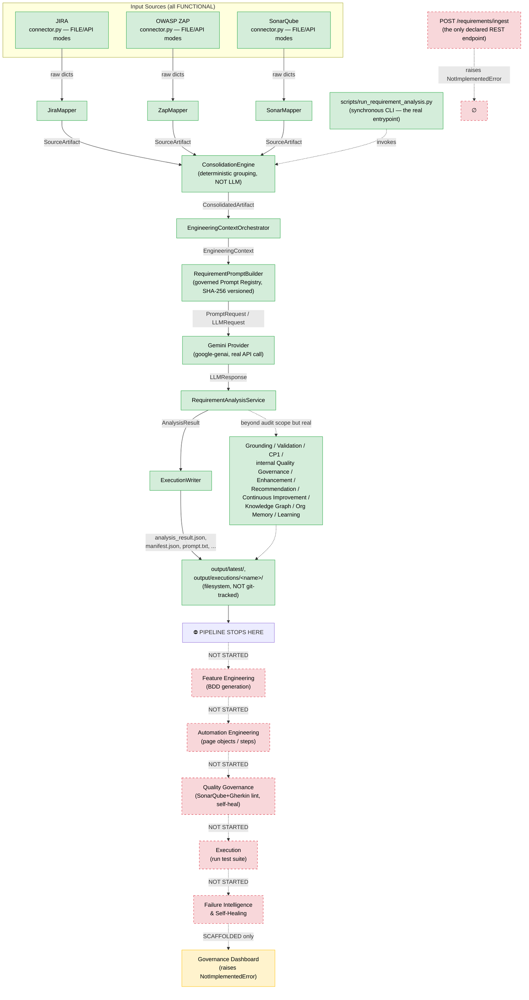
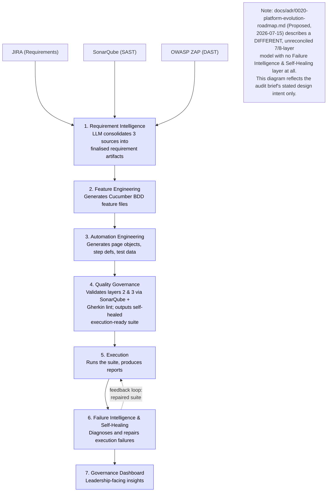

# Codebase Audit — Autonomous Test Engineering Platform

**Date:** 2026-07-24
**Method:** Direct file reads + read-only shell (`find`/`grep`/`git`) against the repository at
`/Users/sarathv/Personal Project Repos/Autonomous Test Engineering Platform`, branch `main`,
clean working tree at time of audit. No files were modified except this report.
**Ground rule applied throughout:** every statement below is grounded in a file that was
actually opened and read (path + line number cited). Where evidence is partial or inferred,
it is labeled explicitly rather than presented as fact. This audit does not reference or rely
on the two pre-existing self-audits already present in the repo
(`docs/architecture/RAAR-001-Repository-Architecture-Assessment.md`,
`docs/EIOS-REPOSITORY-AUDIT-implementation-baseline.md`) — all findings here are independently
re-derived from primary sources, per instruction.

---

## Step 1 — Reconnaissance

### 1.1 Repository structure (top level, generated/cache dirs excluded)

```
.
├── app/                        # FastAPI composition root (main.py, api/, core/)
├── requirement_intelligence/   # The only implemented layer (~280 files)
├── feature_engineering/        # Placeholder: __init__.py + README only
├── automation_engineering/     # Placeholder: __init__.py + README only
├── quality_governance/         # Placeholder: __init__.py + README only (name collides with
│                                #   a real, unrelated package inside requirement_intelligence/)
├── execution/                  # Placeholder: __init__.py + README only (name collides with
│                                #   a real, unrelated package inside requirement_intelligence/)
├── failure_intelligence/       # Placeholder: __init__.py + README only
├── governance_dashboard/       # __init__.py + README + app.py (stub, raises NotImplementedError)
├── shared/                     # contracts/, enums/, exceptions/, utils/ — cross-layer kernel
├── infrastructure/             # logging/ (structlog wrapper); config/ is README-only
├── scripts/                    # bootstrap.sh, run_requirement_analysis.py (the real entrypoint)
├── docs/                       # ~140 markdown files, two independent documentation tracks
├── tests/                      # unit/ (~150 files, populated); integration/ and e2e/ (empty)
├── output/                     # Generated run artifacts (git-ignored, NOT tracked — see §1.4)
└── platform/                   # Empty, UNTRACKED scaffold for a Java microservice — see below
```

**`platform/` is a dead, untracked scaffold.** `git ls-files platform/` returns zero files;
every subdirectory under `platform/docs/` and
`platform/implementation/execution-context-service/src/` is empty (confirmed via
`find platform -type d -empty`). It reserves a location for a Java
"execution-context-service" with no `pom.xml`/`build.gradle` and no source files. It exists
on disk but is invisible to git — a teammate cloning the repo would never see it. Flagged as
a surprise: no design document in `docs/` explains its purpose.

`requirement_intelligence/` is dramatically larger than the other six layers combined —
60+ subpackages including `connectors/`, `consolidation/`, `context_orchestration/`,
`prompts/`, `llm/`, `grounding/`, `validation/`, `normalization/`, `cp1/`,
`quality_governance/`, `enhancement/`, `recommendation/`, `continuous_improvement/`,
`knowledge_graph/`, `organizational_memory/`, `learning/`. Most of these extend beyond what
the user's 7-layer brief calls "Requirement Intelligence" — they are a second, undocumented
tier of capability (internally labeled CAP-081 through CAP-087 per commit history) built
entirely inside Layer 1's package, not as separate top-level layers.

### 1.2 Documentation inventory

`README.md` (root): states Python 3.11+/FastAPI modular monolith, Google Gemini AI provider,
Phase 1 complete/Phases 2–7 placeholders (README.md:25-28, quoted in full):

> "Phase 1 is implemented end to end: connectors (FILE and live API ingestion),
> consolidation, engineering context orchestration, prompt governance, Gemini analysis,
> evidence grounding & traceability, normalization, response validation, CP1
> engineering-readiness, and the execution package. Architecture Version 1.2.0."

`README.md:42-57` "Platform Evolution" table lists capability milestones CAP-070 through
CAP-077 as the "capability timeline" for the current runtime — all inside Layer 1.

No standalone `ROADMAP.md`, `TODO.md`, or `CHANGELOG.md` exists; roadmap content lives in
`README.md`'s evolution table and in `docs/adr/0020-*.md`. `docs/releases/*.md` serves the
changelog role.

**Two parallel, largely disconnected documentation tracks coexist in `docs/`:**
- **Track A** (`docs/adr/0001`–`0030`, `docs/architecture/*`, `docs/governance/*`,
  `docs/proposals/*`, `docs/reviews/*`, `docs/releases/*`) — governs the real,
  implemented `requirement_intelligence/` code. 30 numbered ADRs dated 2026-06-18 through
  2026-07-21; most concerning live subsystems (Grounding ADR-0016, Quality Governance
  ADR-0017, Prompt Governance ADR-0014) are **Accepted**; the pure-roadmap ones
  (**ADR-0020**, 2026-07-15, "Platform Evolution Roadmap & Architectural Constitution") are
  **Proposed**, i.e. not ratified.
- **Track B** (`docs/product/{ADR,PRD,PRA,CAP,RUN,SYS,IMP}-*`, `docs/handbook/HB-001`,
  `docs/standards/STD-000`–`009`) — a separate enterprise-architecture methodology chain,
  entirely **Draft**, with no code behind it.

Both tracks independently define a `CAP-001` identifier for two different things (Track A:
"Connector Framework & Registry" per `docs/governance/platform-capability-matrix.md`; Track
B: "Requirements Intelligence" per `docs/product/CAP-001-requirements-intelligence.md`). The
repository's own governance process is actively working this collision as action item
ACT-001 (`docs/architecture/architecture-action-register.md`), status **"Identified"**
(not yet resolved) as of the most recent commits (2026-07-24).

**ADR-0020** (`docs/adr/0020-platform-evolution-roadmap.md`, Proposed, 2026-07-15) defines a
*different* 7/8-layer model than the user's brief: Layer 1 Requirement Intelligence → Layer 2
Continuous Learning → Layer 2.5 Executable Specification Engineering (added later by
ADR-0030) → Layer 3 Feature Engineering → Layer 4 Prediction & Insights → Layer 5
Optimization → Layer 6 Autonomous Engineering → Layer 7 Organizational Intelligence. This
model has **no "Failure Intelligence & Self-Healing" layer at all** — its nearest analog,
"Autonomous Engineering," is defined as governed autonomous *action-taking*
(story/automation generation, PR prep), not failure diagnosis/repair. This is a real,
unreconciled conflict between two documents in the same repo and is treated here as a fact
about the repo, not adopted as the audit's target model (per the audit's own brief, the
user's stated 7-layer design is the target).

Module-level READMEs for all six placeholder packages (`feature_engineering/README.md`,
`automation_engineering/README.md`, `quality_governance/README.md`, `execution/README.md`,
`failure_intelligence/README.md`, `governance_dashboard/README.md`) were read in full — each
is ~10 lines, states `**Status:** Planned (Phase N — not implemented)`, and describes itself
as "a placeholder reserving the layer's location in the modular monolith" that "will follow
the same internal structure as the Requirement Intelligence Layer... and expose a `router`
that is mounted in `app/api/router.py` when the layer is activated." Verbatim text is
identical across all five non-dashboard READMEs, differing only in the one-line purpose
statement and phase number.

### 1.3 Build / dependency manifests

| File | Language | Key contents |
|---|---|---|
| `pyproject.toml` (60 lines) | Python | `requires-python >=3.11`; `[tool.ruff]` (line-length 100, rule sets E/W/F/I/N/UP/B/ASYNC/S/RUF); `[tool.mypy]` `strict = true`; `[tool.pytest.ini_options]` `testpaths = ["tests", "requirement_intelligence/tests"]`, markers `unit`/`integration`/`e2e`/`productization`. No `[build-system]` table (no packaging backend configured). |
| `requirements.txt` | Python (runtime) | FastAPI `>=0.111,<1.0`; `uvicorn[standard]`; `pydantic>=2.7`/`pydantic-settings`; `google-genai>=1.0,<2.0` (active LLM SDK); `openai>=1.30,<2.0` + `tiktoken` (Azure OpenAI — reserved, stub only); `jira>=3.8,<4.0` (declared but the JIRA connector uses `httpx` directly, not this SDK — see §3.3); `httpx>=0.27,<1.0`; `sqlalchemy>=2.0` + `alembic>=1.13` + `psycopg[binary]>=3.1` (Postgres, explicitly commented "wired in a future phase," unused); `structlog`, `rich`, `jinja2`, `tenacity`; `streamlit>=1.35,<2.0` (Governance Dashboard, unused). |
| `requirements-dev.txt` | Python (dev) | `pytest>=8.2`, `pytest-asyncio`, `pytest-cov`, `respx` (httpx mocking); `ruff`, `mypy`; `pip-tools`, `pre-commit`. |
| `platform/implementation/execution-context-service/` | Java (intended) | No `pom.xml`/`build.gradle` exists; directory is entirely empty. |

No `package.json`, `pom.xml`, `build.gradle`, `Cargo.toml`, or `go.mod` exists anywhere in
the tracked repository.

### 1.4 Configuration

`.env.example` (148 lines, read in full): `EXECUTION_MODE=FILE|API` (global ingestion-mode
switch); `GOOGLE_API_KEY`/`GEMINI_MODEL` (default `gemini-2.5-pro`); `AZURE_OPENAI_*`
(reserved, unused); `JIRA_BASE_URL/EMAIL/API_TOKEN/PROJECT_KEY`;
`SONAR_BASE_URL/TOKEN/PROJECT_KEY/BRANCH`; `ZAP_BASE_URL/API_KEY/TARGET_URL`;
`INPUT_DIRECTORY`/`OUTPUT_DIRECTORY`/`REPORT_DIRECTORY`. A real `.env` (6473 bytes) and a
stray `.env.cap074a.bak` are present on disk, git-ignored per `.gitignore` — contents not
opened (may hold live secrets).

`.gitignore:39` lists `output/`. **Verified**: `git ls-files output/` returns 0 files and
`git status --porcelain output/` returns nothing — `output/` is present in the working copy
but genuinely untracked, consistent with `.gitignore`. (No contradiction; this closes an
open question one of the reconnaissance passes had flagged as unverified.)

`app/core/settings.py` (52 lines): `pydantic-settings` `Settings` class loading `.env`,
covering only app-level fields (`app_name`, `app_env`, `app_debug`, `api_host`, `api_port`,
`log_level`, `log_json`, `database_url` — the last under a `# --- Persistence (future
phase) ---` comment). It does **not** own JIRA/Sonar/ZAP/LLM credentials — those are resolved
per-connector via `requirement_intelligence/connectors/api_client.py:58-111`
(`resolve_secret_field`), which reads only environment-variable *names* referenced from
`requirement_intelligence/config/source-registry.json`, never literal secrets.

No Docker files (`Dockerfile`, `docker-compose.yml`) and no CI config
(`.github/workflows/`, `.gitlab-ci.yml`, `Jenkinsfile`, `.circleci/`) exist anywhere in the
tracked repository — confirmed by direct `find`.

`Makefile` (47 lines): `install`, `dev`, `run` (`uvicorn app.main:app --reload`), `dashboard`
(`streamlit run governance_dashboard/app.py`), `lint`/`format` (ruff), `typecheck` (mypy),
`test` (pytest), `cov`, `check` (lint+typecheck+test), `clean`. This is a local developer
convenience target set, not wired to any automation.

### 1.5 Entrypoints

| Entrypoint | File : Line | What it is |
|---|---|---|
| FastAPI app factory / ASGI app | `app/main.py:42` (`create_app()`), `app/main.py:68` (`app = create_app()`) | Served via `uvicorn app.main:app --reload`. |
| App lifespan hook | `app/main.py:28-39` | Configures logging, logs startup/shutdown only — no connection pools, no connector health checks despite the docstring inviting them. |
| Health check | `app/main.py:60-63` | `GET /health` → `{"status": "ok", "env": ...}`. Only real HTTP behavior the ASGI app exposes today. |
| Aggregate router | `app/api/router.py:14-24` | Mounts only `requirement_intelligence_router` (line 17); lines 20-24 are commented-out `include_router` calls for the five unbuilt layers. |
| Requirement Intelligence router | `requirement_intelligence/api/router.py:13-15` | `/requirement-intelligence` prefix. |
| **The platform's one documented REST endpoint — unimplemented** | `requirement_intelligence/api/routes/requirements.py:19-32` | `POST /api/v1/requirement-intelligence/requirements/ingest`. Body is `raise NotImplementedError("Requirement ingestion pipeline not yet implemented")` (line 32). Docstring (lines 6-7) states plainly: "intentionally not wired yet... the platform is CLI-first today." |
| **Primary real entrypoint: CLI** | `scripts/run_requirement_analysis.py` (1448 lines) | `argparse`-based, git/docker-style subcommands: `analyze`, `health`, `list-artifacts`, `version`, `help` (`build_parser()` at line 1274). `main(argv=None) -> int` at line 1358; `if __name__ == "__main__":` guard at line 1447. |
| Governance Dashboard (stub) | `governance_dashboard/app.py:12-14` | `main()` body is `raise NotImplementedError("Governance Dashboard not yet implemented")`. Runnable (`make dashboard`) but crashes immediately. |
| Dev bootstrap | `scripts/bootstrap.sh` | Creates `.venv`, installs deps, copies `.env.example` → `.env` if missing. Environment setup only. |

**No scheduled jobs / cron / task queue exists.** No Celery, APScheduler, or cron usage found
anywhere in `.py`/`.toml`/`.yml`. Every real execution today is either CLI-invoked or
(unimplemented) HTTP-triggered — there is no scheduler.

### 1.6 Git

Current branch: `main`, clean, up to date with `origin/main`. Only branch that exists —
`git branch -a` shows `main`, `remotes/origin/HEAD -> origin/main`, `remotes/origin/main`.
Total commits: 1290 (`git log --oneline --all | wc -l`). Last 5 commits (all 2026-07-24, all
governance-process artifacts, none touching application code):

```
a3f6b7f  Verification Evidence
648bd4a  Governance Designation Record
e9f226d  Architecture Action Execution record v2
204360e  architecture governance guide
6ae6ade  Architecture Review Board Decision Record
```

The single commit that created `execution/`, `failure_intelligence/`, and
`governance_dashboard/` is the initial commit (`28d0284`, 2026-06-18); `git log --
execution/` and equivalent for the other two show **zero** subsequent commits despite ~1260
commits since, all concentrated in `requirement_intelligence/` and its later
sub-capabilities plus the documentation tracks.

---

## Step 2 — Layer-by-layer status

Evidence-quality legend: **HIGH** = implementation read directly; **MEDIUM** = read partially
/ inferred from adjacent code with some direct confirmation; **LOW** = inferred from naming
only (none of the findings below rely on LOW evidence; where evidence was originally MEDIUM
it has been upgraded to HIGH during this audit by reading the remaining function bodies).

### 2.1 JIRA Connector — Status: **FUNCTIONAL** (evidence: HIGH)

- Files: `requirement_intelligence/connectors/jira/connector.py` (262 lines, class
  `JiraConnector(SourceConnector)`); base contract `requirement_intelligence/connectors/base.py`
  (`SourceConnector` ABC, lines 14-112); shared transport
  `requirement_intelligence/connectors/api_client.py`; mapper
  `requirement_intelligence/mappers/jira_mapper.py` (`JiraMapper`, 160 lines).
- Behavior: mode selected globally by `EXECUTION_MODE` env var, per-source config from
  `requirement_intelligence/config/source-registry.json`. FILE mode reads
  `requirement_intelligence/input/jira/jira-issues.json`. API mode
  (`_fetch_from_api`, lines 171-231) builds JQL via `_build_jql` (lines 144-169: project key
  + optional `api.jql` restriction + optional `api.incremental.jql` clause), authenticates
  with `httpx.BasicAuth(email, token)`, and pages `/rest/api/2/search/jql` using **cursor
  pagination** (`nextPageToken`/`isLast`), capped at `_MAX_ISSUES = 10_000` (line 41). Code
  comment (lines 34-38) documents `/rest/api/2/search` returns HTTP 410 and this endpoint is
  the replacement.
- **Incremental sync**: supported via a static config-driven JQL clause
  (`api.incremental.jql`), not a dynamically persisted "last synced" cursor — the shipped
  `source-registry.json:45-48` has it **disabled** (`"incremental": {"enabled": false, "jql":
  "updated >= -30d"}`). As configured today, every run is a full fetch bounded only by the
  base JQL restriction (`issuetype in (Story, Bug, Epic)`) and `_MAX_ISSUES`.
- Input contract: `source_config` dict (`connection.baseUrlEnv=JIRA_BASE_URL`, etc.) from the
  registry.
- Output contract: `list[dict]` raw issues → `JiraMapper.map()` → `list[SourceArtifact]`,
  consumed by `ConnectorRegistry.execute_all()`
  (`requirement_intelligence/registry/connector_registry.py:133-143`).
- External deps: `httpx` via `ApiClient` — bounded exponential-backoff retry (3 attempts
  default), 30s timeout, retryable `{429,500,502,503,504}`, fail-fast auth `{401,403}`.
- Stubbed/dead code: none. Note: `requirements.txt` declares the official `jira` SDK
  (`jira>=3.8,<4.0`) but the connector does not import or use it — it talks to the REST API
  directly via `httpx`. This is an unused dependency, not a stub.
- Tests: `requirement_intelligence/tests/unit/{test_connectors.py, test_connector_api.py,
  test_connector_io.py, test_jira_mapper.py}`.

### 2.2 SonarQube Connector — Status: **FUNCTIONAL** (evidence: HIGH)

- Files: `requirement_intelligence/connectors/sonarqube/connector.py` (257 lines, class
  `SonarQubeConnector`); mapper `requirement_intelligence/mappers/sonar_mapper.py` (115
  lines).
- Behavior: FILE mode reads `requirement_intelligence/input/sonar/sonar-issues.json`. API
  mode (`_fetch_from_api`, lines 163-216) authenticates with the token as HTTP Basic
  username / empty password (line 179, SonarQube convention), pages `/api/issues/search` via
  `p`/`ps` (page size capped at `_MAX_PAGE_SIZE=500`, `_build_params` lines 144-161), supports
  optional `branch` and optional incremental `createdAfter` filter, stops on
  `payload.paging.total` (`_resolve_total`, lines 218-226).
- **Incremental sync**: same pattern as JIRA — config-driven `createdAfter`, and the shipped
  `source-registry.json:114-117` has it **disabled** (`"incremental": {"enabled": false,
  "createdAfter": ""}`). Full fetch every run as configured.
- Output contract: raw dicts → `SonarMapper` → `SourceArtifact` (`source_category=QUALITY`,
  `source_type="sast"`).
- Real ingestion evidence: `output/latest/prompt.txt` (lines 111-165) contains genuine
  SonarQube findings rendered into the LLM prompt (e.g. `java:S2925 Remove this use of
  "Thread.sleep()"`, custom rule `customqa:direct-webdriver-action`) against a real target
  file `Automation-POC:src/test/java/com/automation/pages/badexamples/BadLoginPage.java`.
- Tests: `test_connectors.py`, `test_connector_api.py`, `test_sonar_mapper.py`.

### 2.3 OWASP ZAP Connector — Status: **FUNCTIONAL** (evidence: HIGH)

- Files: `requirement_intelligence/connectors/zap/connector.py` (215 lines, class
  `ZapConnector`); mapper `requirement_intelligence/mappers/zap_mapper.py` (102 lines).
- Behavior: FILE mode reads `requirement_intelligence/input/zap/zap-alerts.json`. API mode
  (`_fetch_from_api`, lines 134-186) sends the API key both as `apikey` query param and
  `X-ZAP-API-Key` header (comment, lines 148-149: "so the connector works regardless of the
  daemon's configured key mode"), pages the ZAP daemon's `/JSON/core/view/alerts/` via
  `start`/`count`, capped at `_MAX_ALERTS=50_000`.
- **Incremental sync**: none. `source-registry.json`'s `owasp_zap` entry (lines 52-83) has no
  `incremental` block at all — no code path supports it for this connector.
- Output contract: raw dicts → `ZapMapper` → `SourceArtifact` (`source_category=SECURITY`).
- Observation: in the actual `output/latest/` run, the prompt's Security Findings section is
  empty (`(none provided)`) — an artifact of the bundled sample `zap-alerts.json` fixture
  content for that specific run, not evidence the connector is broken (JIRA/Sonar evidence
  for the same run is populated).
- Tests: `test_connectors.py`, `test_connector_api.py`, `test_zap_mapper.py`.

**Common connector infrastructure**: `requirement_intelligence/connectors/base.py` defines
the `SourceConnector` ABC (lines 14-112: `get_source_id`, `get_source_name`,
`validate_connection`, `fetch_raw_records`, `get_metadata`) that all three real connectors
implement. `requirement_intelligence/connectors/api_client.py` (386 lines) is a fully
implemented, source-agnostic `ApiClient` (lines 192-387) with `RetryPolicy` (dataclass, lines
132-149) and env-var-only secret resolution (`resolve_secret_field`, lines 58-111).
`requirement_intelligence/registry/connector_registry.py` dynamically loads connector/mapper
classes by dotted path from `source-registry.json` and validates
`connector.get_source_id()` matches the registry's declared `sourceId` at startup.

### 2.4 Layer 1 — Requirement Intelligence ("LLM consolidates the three sources into finalised requirement artifacts") — Status: **FUNCTIONAL** (evidence: HIGH)

The user's phrase "consolidates... into finalised requirement artifacts" actually spans two
distinct, separately-implemented stages:

1. **Deterministic grouping (not LLM)** —
   `requirement_intelligence/consolidation/consolidation_engine.py` (110 lines),
   `ConsolidationEngine.consolidate()` (lines 34-72). Buckets `SourceArtifact`s by a fixed
   cascade (component → shared tag → endpoint → risk category, in `consolidation_rules.py`)
   into `ConsolidatedArtifact` groups. Explicitly documented (lines 7-11) as calling no
   connector, mapper, or LLM. Line 10 explicitly states this stage does **not** "build a
   `RequirementPackage`" — confirming that model (§3.2) is unused by design at this stage.
2. **LLM-based analysis** — `RequirementAnalysisService`
   (`requirement_intelligence/analysis/requirement_analysis_service.py`, 196 lines) is what
   actually produces the "finalised" output.

Orchestration chain (from `scripts/run_requirement_analysis.py` docstring, lines 16-23):
Connectors → Mappers → Consolidation Engine → `EngineeringContextOrchestrator` →
`EngineeringContext` → `RequirementAnalysisService` (→ `RequirementPromptBuilder` →
`PromptRequest`/`LLMRequest` → LLM Provider → `LLMResponse`) → `AnalysisResult`.

- `RequirementPromptBuilder.build()`
  (`requirement_intelligence/prompts/requirement_prompt_builder.py:185-207`) renders the
  `EngineeringContext` into a prompt resolved from a versioned Prompt Registry
  (`requirement_intelligence/prompts/framework/prompt_registry.py`, SHA-256-verified against
  `requirement_intelligence/prompts/versions/manifest.json`).
- `RequirementAnalysisService._orchestrate()` (lines 133-170) builds the prompt, converts to
  `LLMRequest`, calls `provider.generate(llm_request)`, wraps into `AnalysisResult`.
- LLM provider: `requirement_intelligence/llm/providers/gemini_provider.py` (270 lines) — real
  adapter over `google-genai` (`from google import genai`, lazily imported line 168). Reads
  `GOOGLE_API_KEY` (required) and `GEMINI_MODEL` (default `gemini-2.5-pro`, line 44). Single
  call: `client.models.generate_content(model=..., contents=..., config={"temperature":
  ...})` (lines 200-205). No retries at this layer (documented, line 198).
- **Azure OpenAI provider is a hard stub**:
  `requirement_intelligence/llm/providers/azure_openai_provider.py` — every method
  unconditionally raises `NotImplementedError` (lines 34-63); comment: "Licensing status: NOT
  YET AVAILABLE — stub only." Registered in `llm_factory.py`'s `_PROVIDER_REGISTRY` purely so
  the name is a valid selectable value.
- Real execution evidence (`output/latest/analysis_result.json`, `prompt.txt`,
  `raw_llm_response.json`): a completed run dated `2026-07-20T07:01:56Z`–`07:02:00Z`
  (`durationMs: 3812.26`), `provider: "gemini"`, `model: "gemini-3.1-flash-lite"` (env
  override, differs from the code default `gemini-2.5-pro`), real token usage
  (`prompt_tokens: 4774, completion_tokens: 706, total_tokens: 5480`), genuine JSON output
  (`functional_requirements`, `security_requirements`, `quality_requirements`, `risks`,
  `recommendations`) traceable to real input evidence (e.g. a "replace Thread.sleep()"
  requirement directly traces to the SonarQube `java:S2925` finding shown in the same
  `prompt.txt`).
- Output contract: `AnalysisResult`, persisted by `ExecutionWriter`
  (`requirement_intelligence/execution/execution_writer.py`) to `output/latest/` and
  `output/executions/<name>/` as `analysis_result.json`, `raw_llm_response.json`,
  `llm_request.json`, `prompt.txt`, plus `manifest.json`. This is a flat JSON of requirement
  statement lists, **not** a structured, ID-bearing canonical requirement schema — the models
  that would provide that (`CanonicalRequirement`, `RequirementPackage`, §3.2) exist but are
  not what `AnalysisResult` actually returns.
- What is NOT done: no database persistence (all filesystem JSON under `output/`); no caching;
  no retry at the orchestration layer (explicitly out of scope per
  `requirement_analysis_service.py:15-19`).
- Beyond this: a further chain of real, evidenced subsystems exists (Requirement Enhancement,
  Grounding, Validation, CP1, a same-named-but-different "Quality Governance," Recommendation,
  Continuous Improvement, Knowledge Graph, Organizational Memory, Learning) — all real Python
  packages with real result objects in `output/latest/`, but outside the scope of the user's
  7-layer brief; flagged only because their outputs could be mistaken for later layers (see
  §2.7 naming collision).

### 2.5 Layer 2 — Feature Engineering (Cucumber BDD generation) — Status: **NOT STARTED** (evidence: HIGH)

- Files: `feature_engineering/__init__.py` (0 bytes), `feature_engineering/README.md` (11
  lines, "Status: Planned (Phase 2 — not implemented)").
- `grep -rli "cucumber|gherkin|feature file|step definition|page object"` across all `.py`
  files (excluding tests) returns **zero matches**. `find . -iname '*.feature'` returns
  **zero matches**.
- Not mounted: `app/api/router.py:20` — `# api_router.include_router(feature_engineering_router)`.
- Input/output contract: none exists to trace. README states the intended input is "CP1
  output" (a real, implemented result type in `requirement_intelligence/cp1/`), but no
  consumer code exists.

### 2.6 Layer 3 — Automation Engineering (page objects, step defs, test data) — Status: **NOT STARTED** (evidence: HIGH)

- Files: `automation_engineering/__init__.py` (0 bytes), `automation_engineering/README.md`
  (10 lines, "Status: Planned (Phase 3 — not implemented)").
- Same grep evidence as §2.5 applies — no page-object/step-definition generation logic
  anywhere.
- Not mounted: `app/api/router.py:21`.
- No dependency on Feature Engineering's output found (unsurprising — neither exists).

### 2.7 Layer 4 — Quality Governance (validate layers 2 & 3 via SonarQube + Gherkin lint, self-heal) — Status: **NOT STARTED as specified** (evidence: HIGH), with a critical naming collision

- Top-level package: `quality_governance/__init__.py` (0 bytes),
  `quality_governance/README.md` ("Status: Planned (Phase 4 — not implemented)"). Not
  mounted: `app/api/router.py:22`. No Gherkin-lint or SonarQube-of-generated-code logic
  exists anywhere.
- **A different, fully-implemented "Quality Governance" exists** at
  `requirement_intelligence/quality_governance/` (`assessment/`, `decision/`, `evaluation/`,
  `identity/`, `models/`, `policy/`, `rules/`, `serialization/`). Read
  `requirement_intelligence/quality_governance/models/enums.py` in full (95 lines): it
  computes a `QualityDecision` (`PASS` / `PASS_WITH_WARNINGS` / `FAIL`) described (lines
  15-16) as "the governed release decision for **one Requirement Intelligence run**." Its
  three peer inputs, `QualityInputSource` (lines 72-82), are exactly **`GROUNDING`,
  `VALIDATION`, `CP1`** — i.e. it governs the quality of the *LLM-generated requirement
  analysis itself*, invoked from `scripts/run_requirement_analysis.py`
  `run_quality_governance_phase()` (lines 504-539) with `grounding_result, validation_result,
  cp1_result`. It has no knowledge of SonarQube-on-generated-code, Gherkin, or automation
  self-healing. Its output (`output/latest/quality_governance_result.json`,
  `quality_governance_report.md`) is a release/no-release verdict on the requirement
  analysis, not a validated/self-healed BDD+automation suite.
- **Conclusion**: the Layer 4 described in the brief does not exist in any form. The
  identically-named subsystem inside `requirement_intelligence/` governs a completely
  different pipeline stage and must not be conflated with it.

### 2.8 Layer 5 — Execution — Status: **NOT STARTED** (evidence: HIGH)

- Files: `execution/__init__.py` (0 bytes), `execution/README.md` (11 lines, "Status: Planned
  (Phase 5 — not implemented)"). Not mounted: `app/api/router.py:23`.
- No test-runner dependency (pytest-html, Selenium, Playwright, Cucumber-Java, JUnit, Allure)
  appears in `requirements.txt`/`requirements-dev.txt`.
- **Naming collision, verified**: a second, unrelated package
  `requirement_intelligence/execution/` is real — it contains `execution_writer.py`
  (`ExecutionWriter`), `manifest_builder.py`, `cp1_report_builder.py`, etc., documented in
  `docs/architecture/execution-package.md`. This is the **serialization/artifact-writing
  layer for Requirement Intelligence runs** — it writes `output/*/manifest.json` and peer
  files. It has nothing to do with running a test suite. Likewise `output/executions/` (e.g.
  `output/executions/cap074a-api-rehearsal/`) refers to **runs of the requirement-analysis
  CLI**, not test executions. Any claim that "the Execution layer writes to
  `output/executions/`" would be wrong — that is Layer 1's own artifact output.
- Input/output contract: none defined for the actual Layer-5 concept; only aspirational
  prose in `docs/architecture/overview.md:52`.

### 2.9 Layer 6 — Failure Intelligence & Self-Healing — Status: **NOT STARTED** (evidence: HIGH)

- Files: `failure_intelligence/__init__.py` (0 bytes),
  `failure_intelligence/README.md` (11 lines, "Status: Planned (Phase 6 — not
  implemented)"). Not mounted: `app/api/router.py:24`.
- Repo-wide grep for `flaky|self.heal|root.cause|auto.heal` (across `.py`/`.md`/`.txt`,
  excluding `.venv`) returns only doc/prose hits describing the *planned* concept — no code,
  model, failure parser, or triage logic anywhere.
- As noted in §1.2, ADR-0020's competing roadmap has no equivalent of this layer at all —
  a real, unreconciled gap between the two design documents in this repo, not something this
  audit resolves.

### 2.10 Layer 7 — Governance Dashboard — Status: **SCAFFOLDED** (evidence: HIGH)

One step above the other unbuilt layers — a real, importable function exists but raises
immediately.

- Files: `governance_dashboard/__init__.py` (0 bytes), `governance_dashboard/app.py` (19
  lines), `governance_dashboard/README.md`.
- `governance_dashboard/app.py:12-14` (quoted in full above, §1.5): `main()` body is
  `raise NotImplementedError("Governance Dashboard not yet implemented")`.
- `Makefile:23-24`: `dashboard:` target runs `streamlit run governance_dashboard/app.py` — it
  would launch and crash immediately.
- `streamlit>=1.35,<2.0` is declared in `requirements.txt` under a "Dashboard (Governance
  Dashboard Layer)" comment — dependency provisioned, zero rendering logic exists.
- No FastAPI router entry (it's a standalone Streamlit script, not mounted via `app/api/router.py`).
- Closest existing "governance data" a future dashboard could consume: hand-maintained
  markdown registers `docs/governance/platform-capability-matrix.md` and
  `docs/governance/architecture-freeze-index.md` — not dashboard-consumable data structures,
  just documents.

---

## Step 3 — Cross-cutting inventory

### 3.1 Orchestration

No REST API drives the pipeline — the one declared endpoint is unimplemented (§1.5,
`requirement_intelligence/api/routes/requirements.py:32`). The real orchestration entry point
is the synchronous CLI `scripts/run_requirement_analysis.py`. Every pipeline-phase function
(`run_engineering_pipeline`, `run_validation_phase`, `run_cp1_phase`,
`run_quality_governance_phase`, `run_learning_phase`, lines 296-775) is a plain `def`, not
`async def` — fully synchronous, single-process, single-run. There is **no job/task model, no
state machine, and no resumability** — a failed run is simply re-invoked from the CLI with no
persisted intermediate state to resume from.

`requirement_intelligence/platform/platform_context.py`: `PlatformContext` (line 187) is a
pure dependency-injection factory — its own docstring (lines 1-9) states it "contains no
business logic — every method only constructs and returns a platform object." The CLI script
sequences phases itself by calling `PlatformContext`'s `create_*` methods in order.

`app/main.py:42-68` mounts only `api_router`, which itself mounts only the Requirement
Intelligence router, and exposes one liveness endpoint. This ASGI app is a separate, largely
inert HTTP surface — it is not the orchestration path.

**Conclusion**: orchestration today = a synchronous CLI script, not a pipeline runner, REST
API, or job engine.

### 3.2 Data contracts

Schemas crossing a layer boundary, all inheriting `shared.contracts.base.Schema`
(`shared/contracts/base.py:15-27` — a frozen, `extra="forbid"`, enum-by-value
`pydantic.BaseModel` subclass used consistently as the platform's DTO base):

| Model | File | Purpose | Actually produced/consumed today? |
|---|---|---|---|
| `SourceArtifact` | `requirement_intelligence/models/source_artifact.py` (140 lines) | Source-agnostic single record (JIRA issue / ZAP alert / Sonar issue) | **Yes** — output of every mapper, input to `ConsolidationEngine`. |
| `ConsolidatedArtifact` | `requirement_intelligence/models/consolidated_artifact.py` (83 lines) | Grouped `SourceArtifact`s by module, split into `functional_artifacts`/`security_artifacts`/`quality_artifacts` | **Yes** — output of `ConsolidationEngine`, input to `EngineeringContextOrchestrator`. |
| `CanonicalRequirement` / `SourceRef` | `requirement_intelligence/models/canonical_requirement.py` (53 lines) | "Single, source-agnostic representation of a requirement... every downstream component operates on one stable contract" | **No.** `grep -rln "CanonicalRequirement" --include="*.py" .` (excluding tests) returns only its own definition file and the package `__init__.py`. Fully **dead / orphaned** — defined, never constructed. |
| `RequirementPackage` | `requirement_intelligence/models/requirement_package.py` (82 lines) | "AI-ready... payload that later phases send to Azure OpenAI for test generation" | **No.** Only reference outside its own file is a negative one: `consolidation_engine.py:10` explicitly states the engine does *not* "build a `RequirementPackage`." Dead / orphaned, and its own docstring names Azure OpenAI (the unimplemented provider) as its intended consumer — doubly speculative. |
| `ParsedResponse` | `requirement_intelligence/models/parsed_response.py` (124 lines) | Immutable canonical structural representation of one AI response, governed by `docs/architecture/response-normalization-contract.md` | Governed/documented extensively (61-line module docstring describing ownership rules), but the module itself notes it is created by "the future `ResponseNormalizer`" (line 23) — worth verifying at implementation time whether the live normalization code actually instantiates this exact class or a different internal representation; not independently re-verified in this pass. |
| `AnalysisResult` | `requirement_intelligence/analysis/analysis_models.py` | Actual output of the LLM analysis step | **Yes** — this, not `CanonicalRequirement`/`RequirementPackage`, is what gets persisted to `output/*/analysis_result.json`. |

**Contract inconsistency found**: two incompatible `SourceConnector` interfaces coexist.
`shared/contracts/base.py:31-51` defines a `SourceConnector` `Protocol` (`source` property,
`health_check()`, `fetch(**query)`) intended per its module docstring (lines 1-6) as "the
stable interfaces layers depend on instead of each other's concrete implementations." **It is
never implemented or referenced by any real connector.** All three actual connectors
(`JiraConnector`, `SonarQubeConnector`, `ZapConnector`) implement a completely separate
`SourceConnector` ABC in `requirement_intelligence/connectors/base.py:14-112`
(`get_source_id`, `get_source_name`, `validate_connection`, `fetch_raw_records`,
`get_metadata` — a different method set entirely). Confirmed via
`grep -rn "SourceConnector"` — the `shared.contracts.base` version has zero implementers
anywhere in the codebase. This is dead scaffolding for a "shared contract" that the real
connector framework does not use.

**Untyped/implicit boundary**: raw connector output (`list[dict[str, Any]]`, e.g.
`JiraConnector.fetch_raw_records()`) is explicitly loose JSON by design — mappers are the
typed boundary. This is a deliberate, documented choice (`connectors/base.py:25-27`: "Do not
transform records into canonical format"), not an oversight.

### 3.3 LLM integration

Provider: Google Gemini via `google-genai` SDK, `gemini_provider.py` (§2.4). Prompts live in
a governed, versioned registry: `requirement_intelligence/prompts/framework/prompt_registry.py`
+ `prompt_loader.py`, with prompt text files under
`requirement_intelligence/prompts/versions/{v1.0.0,v1.1.0}/` and a SHA-256-checksummed
`manifest.json`. Templating/context assembly: `RequirementPromptBuilder`
(`requirement_prompt_builder.py:185-207`) renders an `EngineeringContext` object (built by
`EngineeringContextOrchestrator`) into the prompt. Output parsing: strict JSON, enforced by
prompt instructions and consumed via the normalization/validation subsystems (out of this
audit's core scope but real — see §2.4 "Beyond this"). Retries: **none** at the LLM-call
layer (`gemini_provider.py:198`, explicit). Determinism/temperature: a `temperature` config
value is passed to `generate_content` (`gemini_provider.py:200-205`) — exact default value
not re-verified in this pass. Token/cost handling: `output/latest/analysis_result.json`
records real `prompt_tokens`/`completion_tokens`/`total_tokens`, but no budget/cost-cap logic
was found enforcing them. Evaluation of LLM output quality: real and substantial — the
Grounding, Validation, and (Layer-1-internal) Quality Governance subsystems evaluate output
quality deterministically (non-AI judgement per `docs/adr/0016`/`0017`), but this is
downstream of the LLM call itself, not part of "LLM integration" per se.

### 3.4 Persistence

No database wired. `app/core/settings.py:42`: `database_url: str = Field(default="")` under
`# --- Persistence (future phase) ---`. `sqlalchemy`/`alembic`/`psycopg` are declared in
`requirements.txt` but not imported anywhere in application code (confirmed no usage found
during this audit's reads). All persistence is filesystem JSON: an "Execution Package" per
run under `output/<run-name>/` — `manifest.json` (root index, SHA-256 checksums per artifact,
confirmed by reading `output/latest/manifest.json`'s ~70 top-level keys including
`generatedArtifacts`, `promptSha256`, `responseSha256`), plus `consolidated_artifact.json`,
`engineering_context.json`, `prompt.txt`, `llm_request.json`, `analysis_result.json`,
`raw_llm_response.json`, and conditional per-phase result/report files. Observed run
directories: `output/executions/{cap074a-api-rehearsal, cap074a-file-rehearsal,
cap074b-api-live, demo-readiness-20260720}/`, `output/first_ai_execution/`, `output/latest/`,
`output/model-eval/{gemini-2.5-flash, gemini-3-flash-preview, gemini-3.1-flash-lite}/run-{1,2,3}/`,
`output/releases/ril-rc1-api-validation/`. **None of `output/` is git-tracked** (§1.4,
verified this audit) — it is purely local run output. Naming is ad hoc/human-chosen
(`--execution-name` CLI arg), not a systematic version/timestamp scheme except where the
operator named it that way. Versioning of artifacts is via embedded manifest fields
(`platformVersion`, `baselineVersion`, `executionPackageVersion`,
`connectorRegistryVersion`) plus per-file SHA-256, not a database or object store.

### 3.5 Config and secrets

Covered in §1.4. Summary: app-level config (`app/core/settings.py`) and
domain/connector-level secrets (`connectors/api_client.py:resolve_secret_field`) are two
separate, non-overlapping mechanisms; the latter is env-var-name-indirection only — no
literal secret is ever hardcoded (module docstring, `api_client.py:19-21`).
`EXECUTION_MODE=FILE|API` is the single global switch governing whether connectors read
fixtures or hit live APIs.

### 3.6 Error handling, logging, tracing, observability

Structured logging: `infrastructure/logging/__init__.py` (46 lines) — thin `structlog`
wrapper, `configure_logging()`/`get_logger()`, console renderer by default, JSON when
`json_output=True`. Invoked once at FastAPI startup (`app/main.py:36`, inside `lifespan`).
Connector-level error handling is the most mature part of the codebase: typed exception
hierarchy (`ConnectorConfigurationError`, `ConnectorConnectionError`, `ConnectorFetchError` in
`connector_exceptions.py`), structured `logger.warning`/`logger.info` calls with `extra={...}`
context on every retry attempt (`api_client.py`), and a documented `RetryPolicy`. No tracing
(no OpenTelemetry/Jaeger), no metrics exporter, no APM integration anywhere in
`requirements.txt`/`requirements-dev.txt`.

### 3.7 Tests for the platform itself, and CI/CD

Framework: pytest (`pytest>=8.2`, `pytest-asyncio`, `pytest-cov`, `respx` for httpx mocking).
`pyproject.toml:45-58`: `testpaths = ["tests", "requirement_intelligence/tests"]`, markers
`unit`/`integration`/`e2e`/`productization` (the last explicitly for "CAP-070 golden
end-to-end validation baseline tests"). 176 test files total (`test_*.py`/`*_test.py`,
excluding `.venv`): ~157 under `tests/{unit,integration,e2e,productization}/`, 19 under
`requirement_intelligence/tests/{unit,integration}/`. **`tests/integration/` and
`tests/e2e/` are empty** (only `__init__.py`) despite markers being declared for them in
`pyproject.toml` — a real, verified gap between test configuration and actual test coverage.
No test files exist under `execution/`, `failure_intelligence/`, or `governance_dashboard/`
(consistent with their status). **No CI/CD configuration exists anywhere** — confirmed no
`.github/`, no other CI config. `make check` (lint+typecheck+test) is a local developer
convenience target only. Whether the suite currently passes is not discoverable from CI (none
exists); this audit did not execute the suite to avoid state-changing side effects during a
read-only pass, so pass/fail status is genuinely **unknown**, not assumed.

### 3.8 Connector security

Credential handling: env-var-name indirection via `resolve_secret_field` (§3.5), uniform
across all three connectors — no literal secrets in code or config. Rate limits/retry: shared
`ApiClient.RetryPolicy` applied uniformly — 429/500/502/503/504 retried with exponential
backoff (`backoff_seconds * 2**(attempt-1)`, capped at `max_backoff_seconds`); 401/403/404/
other-4xx fail fast. Pagination: connector-specific by design (`api_client.py` performs no
pagination itself) — JIRA cursor-based (`nextPageToken`), SonarQube offset-based (`p`/`ps`,
stopped via `paging.total`), ZAP offset-based (`start`/`count`, stopped when a page returns
fewer than `page_size`) — all three verified by direct read in this audit (§2.1-2.3), closing
the MEDIUM-confidence gap left by initial reconnaissance. Incremental sync: supported in code
for JIRA and SonarQube (config-driven JQL clause / `createdAfter` respectively) but **disabled
by default** in the shipped `source-registry.json` for both; not supported at all for ZAP.
Every run today is therefore a full fetch in practice, regardless of connector capability.

---

## Step 4 — Gap analysis

### 4.1 Target 7-layer design vs. what exists

| # | Layer (per brief) | Status | Real code exists? | Notes |
|---|---|---|---|---|
| — | JIRA / SonarQube / ZAP connectors | FUNCTIONAL | Yes | Live API + FILE modes, tested. |
| 1 | Requirement Intelligence | FUNCTIONAL | Yes | Deterministic consolidation + real Gemini LLM call, real artifacts. |
| 2 | Feature Engineering (BDD) | NOT STARTED | No | Empty package + README only. |
| 3 | Automation Engineering | NOT STARTED | No | Empty package + README only. |
| 4 | Quality Governance (of code/BDD) | NOT STARTED | No (name reused elsewhere for something unrelated) | Real "Quality Governance" exists but governs requirement-analysis release, not code. |
| 5 | Execution | NOT STARTED | No (name reused elsewhere for something unrelated) | Real `execution/` package exists but is Layer 1's artifact writer. |
| 6 | Failure Intelligence & Self-Healing | NOT STARTED | No | Also absent from the competing ADR-0020 roadmap entirely. |
| 7 | Governance Dashboard | SCAFFOLDED | Partial | One function exists, raises `NotImplementedError` immediately. |

### 4.2 Components missing for one end-to-end run (JIRA/ZAP/SonarQube in → executed suite → report out)

Everything from "finalised requirement artifacts" onward: no BDD feature generation, no
automation code generation, no test execution, no failure diagnosis, no dashboard. The
pipeline today runs exactly from the three connectors through to a JSON requirement-analysis
artifact and stops — roughly the first of seven intended stages. This is a **hard blocker**
for the platform's own stated purpose (an "Autonomous Test Engineering Platform" that has
never executed a test).

### 4.3 Half-finished / dead / duplicated logic

- **Dead data contracts**: `CanonicalRequirement`, `RequirementPackage` (models defined,
  never constructed) and the `shared.contracts.base.SourceConnector` Protocol (defined, never
  implemented — the real connector framework uses a different ABC entirely). See §3.2.
- **Naming collisions** (duplicated identifiers for unrelated things): "Quality Governance"
  (§2.7), "Execution" (§2.8), and `CAP-001` across the two documentation tracks (§1.2).
- **Unused declared dependency**: the `jira` Python SDK is in `requirements.txt` but the JIRA
  connector talks to the REST API directly via `httpx`, not this SDK.
- **Disabled-by-default capability**: incremental sync code exists for JIRA/SonarQube but is
  off in the shipped config — effectively unused in practice today (§3.8).
- **Two disconnected documentation tracks** (Track A real, Track B aspirational/Draft) with
  no formal cross-reference, actively being reconciled via an in-flight governance action
  (ACT-001) that is not yet closed.
- **Untracked dead scaffold**: `platform/` — a Java microservice directory tree, entirely
  empty, invisible to git (§1.1).

### 4.4 Contradictions between code and stated design intent

- The brief's Layer 4 ("validates layers 2 & 3 via SonarQube + Gherkin lint... self-healed
  execution-ready suite") cannot exist yet even in principle, because Layers 2 and 3 (its own
  inputs) don't exist. The identically-named subsystem that does exist governs something else
  entirely (§2.7) — a genuine risk of confusing the two in any future planning conversation
  that searches the codebase for "quality governance."
  - **How to apply**: any spec, ticket, or ADR referencing "Quality Governance" or "Execution"
    from this point forward should disambiguate explicitly (e.g. "Layer 4 (code/BDD quality
    governance, not started)" vs. "Requirement Intelligence's internal Quality Governance
    (`requirement_intelligence/quality_governance/`, live)").
- ADR-0020 (Proposed) describes a fundamentally different 7/8-layer architecture than the
  brief given for this audit, with no Failure Intelligence & Self-Healing layer at all — the
  repository does not currently have one agreed target architecture, it has (at least) two,
  neither formally reconciled with the other.
- README.md and the brief both describe "Phase 1 complete, Phases 2-7 placeholder" — this
  part of the design intent **is** accurately reflected in the code; no contradiction there.

### 4.5 Hard blockers vs. nice-to-haves

**Hard blockers** (must be resolved before any further layer can be built or before the
architecture can be considered locked):
1. Reconcile the "Quality Governance" and "Execution" naming collisions before writing any
   new ADR or ticket that uses either term.
2. Decide which target architecture is authoritative — the brief's 7-layer model or
   ADR-0020 — before locking anything; they currently disagree on the existence of an entire
   layer.
3. No layer beyond Requirement Intelligence has any code, contract, or router scaffolding
   beyond an empty package + README — Layers 2-6 need actual design work, not just
   activation, before implementation can start.
4. No test runner, no BDD tooling, no page-object generation exists — Layers 2, 3, and 5 have
   zero technical foundation to build on within this repo today.

**Nice-to-haves / lower urgency:**
5. Governance Dashboard is closer than the others (a real stub, a declared dependency) —
   lowest-effort layer to bring online first if a quick win is wanted, though it currently has
   nothing real to display (§2.10).
6. `tests/integration/` and `tests/e2e/` being empty despite configured markers is a real gap
   but doesn't block architecture-locking decisions.
7. CI/CD and Docker absence matters for productionization but not for the architectural
   question this audit was scoped to answer.
8. The untracked `platform/` scaffold and the unused `jira` SDK dependency are cleanup items,
   not blockers.

---

## Step 5 — Open questions

1. **Which target architecture is authoritative: the user's 7-layer brief or ADR-0020?**
   Why it matters: they disagree on whether a "Failure Intelligence & Self-Healing" layer
   exists at all, and on the layer ordering/names generally. Options: (a) ratify the brief and
   formally supersede/withdraw ADR-0020, (b) ratify ADR-0020 and update the brief/README to
   match, (c) merge them into one reconciled model via a new ADR.
2. **How should the "Quality Governance" name collision be resolved?** Why it matters: two
   unrelated subsystems share the exact name today; any future work risks being built against
   the wrong one. Options: rename the top-level placeholder package, rename the
   `requirement_intelligence` internal subsystem, or formally scope both under one umbrella
   ADR that names them distinctly (e.g. "Requirement Quality Governance" vs. "Suite Quality
   Governance").
3. **Same question for "Execution."** Options as above.
4. **Is `platform/`'s Java "execution-context-service" scaffold live work-in-progress or
   abandoned?** Why it matters: it's untracked by git, so it could vanish on any clean clone
   or `git clean`, silently losing intent no one else can see. Options: commit it if it's
   real, delete it if abandoned, or document its purpose if it's intentionally kept local.
5. **Should the unimplemented `POST /requirements/ingest` HTTP endpoint be built, or should
   the CLI remain the only supported trigger?** Why it matters: the platform is currently
   CLI-first by explicit design (`requirements.py:7`), but a "Governance Dashboard" and any
   future scheduler would likely need an HTTP trigger. Options: implement it now, defer it
   explicitly with a documented decision, or remove the stub endpoint until it's actually
   planned.
6. **What should happen to the orphaned `CanonicalRequirement` and `RequirementPackage`
   models?** Why it matters: they represent a designed-but-abandoned data contract
   (`RequirementPackage` even names Azure OpenAI, itself unimplemented, as its consumer) —
   keeping unused schemas invites confusion about what the "real" requirement contract is.
   Options: delete them, wire them in as the actual `AnalysisResult` replacement, or document
   them as intentionally reserved for a specific future phase.
7. **Should the dead `shared.contracts.base.SourceConnector` Protocol be removed or should the
   real connectors be migrated to implement it?** Why it matters: it's presented as "the
   stable interface layers depend on" but nothing depends on it; two competing connector
   contracts existing is a maintainability risk once a fourth connector is added. Options:
   delete the Protocol, or refactor the three real connectors onto it and delete the
   ABC in `connectors/base.py`.
8. **Why is the `jira` SDK declared as a dependency if the connector never imports it?** Why
   it matters: unused dependencies inflate the attack surface and install time for no benefit.
   Options: remove it, or clarify whether some other planned component intends to use it.
9. **Should incremental sync be enabled by default for JIRA/SonarQube, or is full-fetch the
   intended steady-state behavior?** Why it matters: currently every run re-fetches
   everything within the JQL/query bound; at scale this could become slow or costly, but no
   decision record exists either way. Options: enable by default with a documented default
   lookback window, leave disabled and document why, or make it environment-driven per
   deployment.
10. **What is the actual criterion for `tests/integration/` and `tests/e2e/` being empty while
    their pytest markers are configured?** Why it matters: it suggests either abandoned intent
    or tests that were meant to be written and weren't — worth knowing which before deciding
    whether it's a gap to close. Options: were these ever populated and later deleted (check
    git history), or were they scaffolded speculatively and never used?
11. **Is the two-documentation-track split (Track A real/live vs. Track B EIOS
    methodology/Draft) intentional and ongoing, or should Track B be retired/merged?** Why it
    matters: maintaining two independent, occasionally colliding (`CAP-001`) documentation
    systems is itself a governance cost; ACT-001 is working one collision but not the
    structural question. Options: formally merge, formally separate with clear scoping rules,
    or sunset Track B.
12. **Should the platform gain a database before or after building Layers 2-7?** Why it
    matters: filesystem-JSON persistence works for a single-operator CLI tool but may not
    scale to multiple concurrent layers writing artifacts, especially once a dashboard needs
    to query across runs. Options: build it now as shared infrastructure, defer until a
    concrete multi-run query need arises, or scope it explicitly to whichever layer first
    needs it (likely Governance Dashboard).
13. **Does the intended architecture want the layers 2-7 to be separate deployable services
    or to remain inside the single FastAPI modular monolith, as ADR-0001 established for
    Layer 1?** Why it matters: `platform/`'s abandoned Java microservice scaffold suggests a
    service-oriented direction was at least considered and dropped; this should be an explicit
    decision, not a default. Options: continue the modular-monolith pattern for all layers, or
    formally decide which layers (if any) should be separate services.
14. **What is the actual intended trigger/scheduling model for a production deployment**
    (currently: none — no scheduler, no queue, CLI or unimplemented HTTP only)? Why it
    matters: "Autonomous" in the platform's name implies some unattended trigger, which
    doesn't exist yet in any form. Options: cron/scheduled job, event-driven (e.g. on JIRA
    webhook), or manual-trigger-only by design.
15. **Should CI/CD be stood up before or in parallel with building Layers 2-7?** Why it
    matters: right now there is zero automated verification of any change — `make check` is
    developer-run only, so regressions in the already-FUNCTIONAL Layer 1 could ship silently
    while new layers are being built. Options: stand up CI now against the existing 176 tests
    as a baseline gate, or accept the risk until more layers exist.

---

## Diagrams

### AS-IS — what the code actually does today



### AS-DESIGNED — the user's stated 7-layer brief (target, not fact about the code)



---

## Appendix — Evidence quality summary

All findings in Step 2 are rated **HIGH** as of this audit: every connector, layer, and
cross-cutting claim above was verified against an opened file, including the three items
initially flagged MEDIUM by earlier reconnaissance (SonarQube/ZAP pagination bodies, JIRA
incremental-sync mechanics) and one item flagged as needing verification (`output/`
git-tracked status) — all closed with direct reads/commands during this audit pass, cited
inline above. One item remains explicitly unresolved rather than asserted: whether the live
normalization code actually instantiates `ParsedResponse` as defined, or a different internal
shape (§3.2) — flagged, not guessed.
